# Upload needed packages
```{r message=FALSE}
library(plyr)
library(tidyverse)
library(DESeq2)
library(dplyr)
library(ggplot2)
```

# Part A: Preparing count matrices and dataframe for binomial test


## Step A-01: Read the data/table
```{r}
counts_2ms01e <- read.table(
  "data/final_counts_2ms01e.txt", sep="\t", header = TRUE)
counts_2ms02g <- read.table(
  "data/final_counts_2ms02g.txt", sep="\t", header = TRUE)
counts_2ms03g <- read.table(
  "data/final_counts_2ms03g.txt", sep="\t", header = TRUE)
counts_2ms04h <- read.table(
  "data/final_counts_2ms04h.txt", sep="\t", header = TRUE)
```

## Step A-02: remove duplicate rows, merge the table, select rows with enough counts

### removing duplicates if they have same start position and transcript_ID
```{r}
counts_2ms01e.DeDup <- counts_2ms01e %>%
  distinct(start, transcript_ID, .keep_all = TRUE)
counts_2ms02g.DeDup <- counts_2ms02g %>%
  distinct(start, transcript_ID, .keep_all = TRUE)
counts_2ms03g.DeDup <- counts_2ms03g %>%
  distinct(start, transcript_ID, .keep_all = TRUE)
counts_2ms04h.DeDup <- counts_2ms04h %>%
  distinct(start, transcript_ID, .keep_all = TRUE)
```

### count the number of rows again
```{r}
nrow(counts_2ms01e.DeDup)
nrow(counts_2ms02g.DeDup)
nrow(counts_2ms03g.DeDup)
nrow(counts_2ms04h.DeDup)
```

## Step A-03: further filtering and renaming
I. select required columns
II. rename columns - to preserve column-sample relationship

### A-03 I: Select only required columns now:
contig, start, end, geneName, geneID, transcriptID,
unqC_My, unqC_Sp, mulC_My, mulC_Sp, totalC_My, totalC_Sp
```{r}
counts_2ms01e.selected <- select(
  counts_2ms01e.DeDup, contig, 
  start, end, gene_Name, gene_ID, 
  transcript_ID, 
  matches("unqC|mulC|totalC", ignore.case = TRUE))

counts_2ms02g.selected <- select(
  counts_2ms02g.DeDup, contig, 
  start, transcript_ID,
  matches("unqC|mulC|totalC", ignore.case = TRUE))

counts_2ms03g.selected <- select(
  counts_2ms03g.DeDup, contig, 
  start, transcript_ID,
  matches("unqC|mulC|totalC", ignore.case = TRUE))

counts_2ms04h.selected <- select(
  counts_2ms04h.DeDup, contig, 
  start, transcript_ID,
  matches("unqC|mulC|totalC", ignore.case = TRUE))
```

### A-03 II: Rename some columns to retain sample-data relationship when merging
```{r}
counts_2ms01e.Renamed <- plyr::rename(
  counts_2ms01e.selected, 
  c(unqC_My = "unqC_My.ms01e", unqC_Sp = "unqC_Sp.ms01e",
    mulC_My = "mulC_My.ms01e", mulC_Sp = "mulC_Sp.ms01e",
    totalC_My = "totalC_My.ms01e", totalC_Sp = "totalC_Sp.ms01e"))

counts_2ms02g.Renamed <- plyr::rename(
  counts_2ms02g.selected, 
  c(unqC_My = "unqC_My.ms02g", unqC_Sp = "unqC_Sp.ms02g",
    mulC_My = "mulC_My.ms02g", mulC_Sp = "mulC_Sp.ms02g",
    totalC_My = "totalC_My.ms02g", totalC_Sp = "totalC_Sp.ms02g"))

counts_2ms03g.Renamed <- plyr::rename(
  counts_2ms03g.selected, 
  c(unqC_My = "unqC_My.ms03g", unqC_Sp = "unqC_Sp.ms03g",
    mulC_My = "mulC_My.ms03g", mulC_Sp = "mulC_Sp.ms03g",
    totalC_My = "totalC_My.ms03g", totalC_Sp = "totalC_Sp.ms03g"))

counts_2ms04h.Renamed <- plyr::rename(
  counts_2ms04h.selected, 
  c(unqC_My = "unqC_My.ms04h", unqC_Sp = "unqC_Sp.ms04h",
    mulC_My = "mulC_My.ms04h", mulC_Sp = "mulC_Sp.ms04h",
    totalC_My = "totalC_My.ms04h", totalC_Sp = "totalC_Sp.ms04h"))
```

## Step A-04: merge/join different dataframes
```{r}
counts.merged.ms1e2g3g4h <- merge(
  counts_2ms01e.Renamed, counts_2ms02g.Renamed,
  by=c("contig", "start", "transcript_ID")) %>% 
  merge(counts_2ms03g.Renamed,
        by=c("contig", "start", "transcript_ID")) %>%
  merge(counts_2ms04h.Renamed,
        by=c("contig", "start", "transcript_ID"))
  # Note: This will merge the dataframes by matching the names of the contig, start, trans_ID
```

## Step A-05: Further filtering

Take the merged data and select only genes/transcripts ..

I. ..with sufficient coverage (above 10 unique counts in at least one haplotype of 4 samples i.e in one unqC columns out of 8 cols)

II. ..with sum(mulC) counts < 10% of sum(totalC)

### A-05: I). Select rows with good coverage (above 10 counts in at least one haplotype)
```{r}
counts.ms1e2g3g4h.Abv10Counts <- filter(
  counts.merged.ms1e2g3g4h, 
  unqC_My.ms01e>10 |unqC_Sp.ms01e>10 |unqC_My.ms02g>10 |unqC_Sp.ms02g>10 
  |unqC_My.ms03g>10 |unqC_Sp.ms03g>10 |unqC_My.ms04h>10 |unqC_Sp.ms04h>10)
```

### A-05: II). select row where mulC reads are less than 20 % of totalCount reads or unqC Reads > 20% totalReads
```{r}
# First sum the unqC, mulC and totalC
counts.ms1e2g3g4h.Summed <- cbind(
  counts.ms1e2g3g4h.Abv10Counts, 
  unqC_total = counts.ms1e2g3g4h.Abv10Counts %>%
    select(matches("unqC")) %>%
    rowSums(),
  mulC_total = 
    counts.ms1e2g3g4h.Abv10Counts %>% 
    select(matches("mulC")) %>%
    rowSums(), 
  totalC_total = counts.ms1e2g3g4h.Abv10Counts %>%
    select(matches("totalC")) %>%
    rowSums())

# Now, Select rows where the mulC reads < 20% of totalReads or unqC Reads > 20% totalReads

counts.ms1e2g3g4h.filt01 <- filter(
  counts.ms1e2g3g4h.Summed, 
  mulC_total < .20*totalC_total | 
    unqC_total > .20*totalC_total) %>% 
  # remove the totaled column
  select(-unqC_total, -mulC_total, -totalC_total) %>%
  # then sort by contig and start position
  arrange(start, contig)
```


## Step-A-06: Prepare dataframe for binomial test analysis 

I). Make a vertical dataframe with unqC reads for My and Sp alleles as separate columns and all of the samples together
II). Apply additional filter (unqC_Sum > 16)

### Step A-06 I). Dataframe for binomial test
```{r}
counts.vert.filt01 <- counts.ms1e2g3g4h.filt01 %>% 
  select(c(gene_ID, transcript_ID, starts_with("unqc"))) %>%
  pivot_longer(-c(gene_ID, transcript_ID)) %>%
  mutate(sample = paste0("2",str_sub(name, -5, -1)),
         allele = str_sub(name, 1, 7)) %>%
  select(-name) %>%
  pivot_wider(names_from = allele, values_from = value)
```


### Step A-06 II). Additional filter

To avoid situations with (0,0) counts and leave some significantly 
```{r}
counts.ForBinom <- counts.vert.filt01 %>%
  mutate(unqC_Sum = unqC_My + unqC_Sp) %>%
  filter(unqC_Sum >= 16)
```


# Part B: Prepare DESeqDataSet Object, sample Info and the design formula

## Step B-01: DESeqDataSet Count Object 
Import the expression data and convert it into a matrix

    # matrix data only has counts with one rowname column
    # > the column "transcript_ID" can be set as rownames
    # > select only unique counts (unqC) columns for data analyses
    
```{r}
expressionData <- data.frame(
  counts.ms1e2g3g4h.filt01, row.names = "transcript_ID") %>%
  select(matches("unqC", ignore.case = TRUE))

head(expressionData)
```

## Step B-02: Sample Info

* design/set covariate factors for the test
  i.e the experimental condition, family, control/treatment group ..
    # .. each sample belongs to

*create a dataframe detailing the above co-variate:sample relationship
   
e.g: # individual <- factor(c(1,1,2,2,3,3,4,4)) # OR
```{r}
  # sample level variates
sampleID <- factor(rep(c("ms01e", "ms02g", "ms03g", "ms04h"), each = 2))
sampleID

  # haplotype level variates
hapType <- factor(rep(c("My", "Sp"), 4))
hapType

  # maternal cytoplasm level variates
cytoplasm = factor(rep("Ma", 8))
cytoplasm

  # family level variates
familyGroup <- factor(rep(c("e", "g", "g", "h"), each=2))
familyGroup
```


## Step B-03: create a dataframe detailing the above co-variate:sample relationship
```{r}
exp_factors = data.frame(sampleID = sampleID, 
                         hapType = hapType,
                         familyGroup = familyGroup, 
                         maternalEff = cytoplasm)
head(exp_factors)
```


## Step B-04: Design formula (experimental design set up for ASE)

* make a design to compare between two haplotypes, after accounting for other variates
* this design can be directly added to DESeq2 algorithm
  
**Optional: if our interest is which genes show ASE differences across different sample IDs (or group) our experimental design would be:
expDesign <- model.matrix(~0 + sampleID + hapType + sampleID:hapType)
```{r}
expDesign <- model.matrix(~0 + sampleID + hapType)
expDesign
colnames(expDesign)
```

## Step B-05: Provide count data as matrix, colData and design

colData (explains the co-variates:sample relationship)
```{r}
ASE_Matrix <- DESeqDataSetFromMatrix(countData = expressionData, 
                                      colData = exp_factors, 
                                      design = ~ 0 + sampleID + hapType)

ASE_Matrix
colnames(ASE_Matrix)
```

## Step B-06: Set normalization factors for all columns to 1 (one) => ..

.. no normalization for any variabilty betweens samples (this is done so that any library size differences won't absorb the ASE)
```{r}
sizeFactors(ASE_Matrix) <- rep(1, 2*4)
```


# Part C: Exploratory analyses, Diagnostic plots and visualization
 
There are two separate paths in this workflow; the one we will see first involves transformations of the counts in order to visually explore sample relationships. In the second part, we will go back to the original raw counts for statistical testing. This is critical because the statistical testing methods rely on original count data (not scaled or transformed) for calculating the precision of measurements.

Details on part-D:
* Exploratory plots can be applied on raw counts to see how the data looks. This can help reveal if distribution of the data is as expected.
* Plot like PCA, dispersion, etc. 
* Depending upon the data the raw data can be transformed as need be to improve exploration/diagnosis

This plot are made using: classic Plot, ggplot2 and functions within DESeq2
Raw counts, transformed raw counts, results are used to prepare this plots


## Step C-01: Work with rlog-transformed data.   # Why transform the data? - See

### Step C-01 I:

Link: https://www.bioconductor.org/help/course-materials/2016/CSAMA/lab-3-rnaseq/rnaseq_gene_CSAMA2016.html#transformations
Link: https://www.bioconductor.org/help/workflows/rnaseqGene/#the-rlog-and-variance-stabilizing-transformations

While the ASE test is done using "DESeq" function plotting of the raw data may cause some problems. Thus it is important to transform the data to make it more homoskedastic and appr. for showing in plots.
We are  using the rlog transformation since is it appr. for small sample (n<100)

```{r}
rld.ASE_Matrix <- rlog(ASE_Matrix, blind = TRUE)  # using rlog
vsd.ASE_Matrix <- vst(ASE_Matrix, blind = TRUE)  # variance stabilizing transformation
```

### Step C-01 II :

Plot the first Haplotype against second haplotype for log2 transformation (simply add 1, to avoid log of zero).

#### Prepare Dataset for plots
```{r}
df.toPlot <- bind_rows(
  as_data_frame(log2(counts(ASE_Matrix, normalized=TRUE)[, 1:2]+1)) %>%
    mutate(transformation = "log2(x + 1)"),
  as_data_frame(assay(rld.ASE_Matrix)[, 1:2]) %>% mutate(transformation = "rlog"),
  as_data_frame(assay(vsd.ASE_Matrix)[, 1:2]) %>% mutate(transformation = "vst"))

colnames(df.toPlot)[1:2] <- c("My", "Sp")
```

#### plot the effects of the different transformation (log2, rlog and vst)
```{r}
df.toPlot <- bind_rows(
  as_data_frame(log2(counts(ASE_Matrix, normalized=TRUE)[, 1:2]+1)) %>%
    mutate(transformation = "log2(x + 1)"),
  as_data_frame(assay(rld.ASE_Matrix)[, 1:2]) %>% mutate(transformation = "rlog"),
  as_data_frame(assay(vsd.ASE_Matrix)[, 1:2]) %>% mutate(transformation = "vst"))

colnames(df.toPlot)[1:2] <- c("My", "Sp")
```

```{r}
ggplot(df.toPlot, aes(x = My, y = Sp)) + geom_hex(bins = 80) +
  coord_fixed() + facet_grid( . ~ transformation) +
  ggtitle("Comparison of different transformation of raw RNAseq counts") + 
  theme(plot.title = element_text(size = 10, face = "bold"))

ggplot(df.toPlot) +
  geom_density(aes(x = My), fill = "blue", alpha = 0.6) +
  geom_density(aes(x = Sp), fill = "light blue", alpha = 0.6) + facet_grid(~ transformation)

ggplot(df.toPlot) +
  geom_histogram(aes(x = My), fill = "blue", alpha = 0.6) +
  geom_histogram(aes(x = Sp), fill = "light blue", alpha = 0.6) + facet_grid(~ transformation)
```

Result: The rlog transformation obviously looks better

## Step C-02: Compare and plot distances between samples

### C-02 I : Sample distances- using "rlog" transformed data

Assess overall similarity between samples

Questions:
  * Are sample similar by haplotypes or are haplotype similar by sample?
  * Do we have roughly equal contribution from all genes?

#### Calculate Euclidian distances between samples
```{r}
sampleDists.ASE_Matrix <- dist(t(assay(rld.ASE_Matrix)))
  # Results: We can see that a Sample-Haplotype is closest to it's own Sample-AltHaplotype
    # then it is more closer to AltSample-Haplotype and then AltSample-AltHaplotype
    # E.g My.ms01e is closest to Sp.ms01e, then to other My haplotype than Sp haplotype
    # My.ms01e vs. Sp.ms01e = 41.85; vs. My.ms02g = 51.021; vs. Sp.ms02g = 62.23
    # is there a way to visualize this sample distances?

plot(hclust(sampleDists.ASE_Matrix))
```


### C-02 II : visualize the sample distances in a heatMap using rlog data

#### Useful packages
```{r}
library("gplots" )
library("RColorBrewer" )
library("pheatmap")
library("PoiClaClu") # For Poisson Distances

colors = colorRampPalette( rev(brewer.pal(9, "Blues")) )(255)
```

#### Prepare dataframes for heatmaps with Euclidian  Distances and Poisson Distances
```{r}
# Euclidean Distances
sampleDistMatrix <- as.matrix(sampleDists.ASE_Matrix)
rownames(sampleDistMatrix) <- paste( rld.ASE_Matrix$hapType ,
                                     rld.ASE_Matrix$sampleID, sep="-" )
colnames(sampleDistMatrix) <- NULL

sampleDistMatrix
```

#### Standard heatmap (Euclidean Distances)
```{r}
pheatmap(sampleDistMatrix,
         clustering_distance_rows = sampleDists.ASE_Matrix,
         clustering_distance_cols = sampleDists.ASE_Matrix,
         col = colors)
```

#### Prepare Dataframe for ggplot heatmap
```{r}
sampleDistDF <- as.data.frame(sampleDistMatrix)
colnames(sampleDistDF) <- c("My-ms01e", "Sp-ms01e", "My-ms02g", "Sp-ms02g", 
                                   "My-ms03g", "Sp-ms03g", "My-ms04h", "Sp-ms04h")

# Make columns from rownames
sampleDistDF$sample_1 <- rownames(sampleDistDF)

# Make long-format data frame
sampleDistDF <- sampleDistDF %>% 
  pivot_longer(!sample_1,
               names_to = "sample_2",
               values_to = "dist")
```

#### GGplot Heatmap
```{r}
# GGplot Heatmap Distances
grDevices::png(filename = "htmp_dist.png",  width = 12.5, height = 8, units = 'cm', res = 400)

htmp_dist <- ggplot(sampleDistDF, aes(sample_1, sample_2, fill = dist)) +
  geom_tile() +
  scale_fill_gradient(low = "#457b92", high = "#f5ffff") +
  labs(title = "Heatmap: sample distances") +
  theme_minimal() +
  theme(
    axis.title.x = element_blank(),
    axis.title.y = element_blank(),
    legend.title = element_blank(),
    plot.title = element_text(size = 12),
    axis.text.x = element_text(angle = 45, hjust=1)
  )

htmp_dist

dev.off()

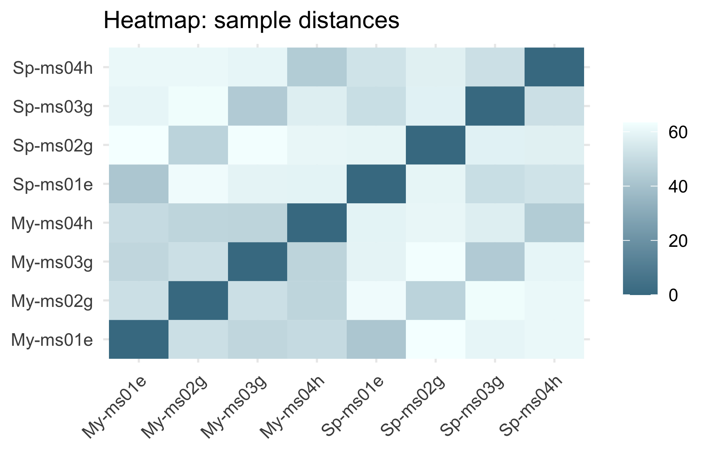
```

### C-02 III : sample distances heatMap using poission
  # this function takes original count matrix (not normalized) with samples as rows
```{r}
poisDists <- PoissonDistance(t(counts(ASE_Matrix)))
samplePoisDistMatrix <- as.matrix(poisDists$dd)

rownames(samplePoisDistMatrix) <- paste(
  rld.ASE_Matrix$hapType, rld.ASE_Matrix$sampleID, sep = "-")

colnames(samplePoisDistMatrix) <- NULL

samplePoisDistMatrix
```

#### Standard heatmap (Poisson distances)
```{r}
pheatmap(samplePoisDistMatrix, 
         clustering_distance_cols = poisDists$dd,
         clustering_distance_rows = poisDists$dd,
         col = colors)
```


#### Prepare Dataframe for ggplot heatmap
```{r}
samplePoisDistDF <- as.data.frame(samplePoisDistMatrix)
colnames(samplePoisDistDF) <- c("My-ms01e", "Sp-ms01e", "My-ms02g", "Sp-ms02g", 
                                   "My-ms03g", "Sp-ms03g", "My-ms04h", "Sp-ms04h")

# Make columns frow rownames
samplePoisDistDF$sample_1 <- rownames(samplePoisDistDF)

# Make long-format data frame
samplePoisDistDF <- samplePoisDistDF %>% 
  pivot_longer(!sample_1,
               names_to = "sample_2",
               values_to = "pois_dist")
```

#### GGplot Heatmap Poisson Distances
```{r}
grDevices::png(filename = "htmp_pois_dist.png",  width = 12.5, height = 8, units = 'cm', res = 400)

htmp_pois_dist <- ggplot(samplePoisDistDF, aes(sample_1, sample_2, fill = pois_dist)) +
  geom_tile() +
  scale_fill_gradient(low = "#457b92", high = "#f5ffff") +
  labs(title = "Heatmap: samples poisson distances") +
  theme_minimal() +
  theme(
    axis.title.x = element_blank(),
    axis.title.y = element_blank(),
    legend.title = element_blank(),
    plot.title = element_text(size = 12),
    axis.text.x = element_text(angle = 45, hjust=1)
  )

htmp_pois_dist
dev.off()

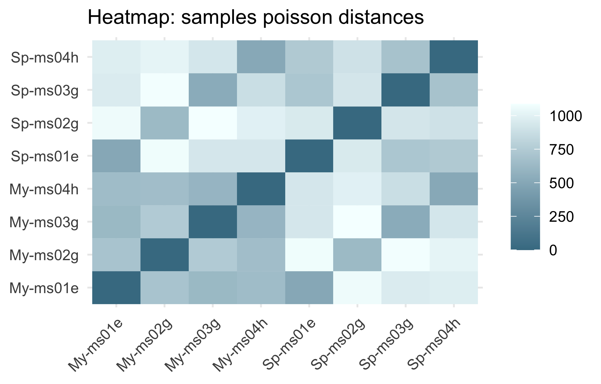
```


## Step C-03: PCA plot

Another way to visualize sample distances is PCA plot. Here the data points are projected on a 2D plane on which one plane explains the most variation while the other plane might explain second most variation

### C-03.I:

#### PCA results
```{r}
# Save the results of pca as dataframe
PcaDF <- plotPCA(rld.ASE_Matrix, intgroup = c("sampleID", "hapType"), returnData = TRUE)

# Plot pca-plot using DESeq2 package
plotPCA(rld.ASE_Matrix, intgroup = c("sampleID", "hapType"))
```

#### GGplot PCA
```{r}
grDevices::png(filename = "pca.png",  width = 12.5, height = 8, units = 'cm', res = 400)

pca <- ggplot(PcaDF,aes(x = PC1,y = PC2,
                       color = group,
                       shape = group)
) +
  # Make a scatter plot
  geom_point(size = 4) +
  scale_color_manual("Sample:hapType",
                     values = c("#E63946","#457b92", "#E63946","#457b92", "#E63946","#457b92", "#E63946", "#457b92")) +
  scale_shape_manual("Sample:hapType",
                     values = c(19, 19, 17, 17, 15, 15, 3, 3)) +
  labs(
    title = "PCA",
    y = "PC2: 23% variance",
    x = "PC1: 26% variance"
  ) +
  theme_bw() + 
  theme(
    panel.grid.major = element_line(colour = 'grey85', size = 0.2),
    panel.grid.minor = element_line(colour = 'grey90', size = 0.1),
    axis.title.x = element_text(size = 10),
    axis.title.y = element_text(size = 10),
    plot.title = element_text(size = 12),
    #legend.position = c(0.8,0.2), #You can adjust legend position here
    #legend.background = element_rect(color = "black")
  )

pca

dev.off()

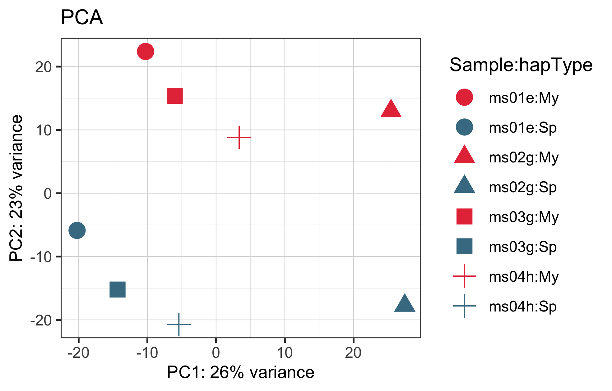
```


Result: there is more variatio between samples than between haplotypes. But the variation between samples in haplotype group is similar to variation between samples in another haplotype group. The sample-by-Haplotype group forms a very distinct cluster i.e same haplotypes are more similar from different samples.


## Step C-04 (**Optional): MDS plot - may be skipped in the pipeline

This is very similar to PCA plot. We use MDS (multidimensional scaling) function R base. This is useful when we don't have matrix of data of matrix of distances.

### C-04.I : MDS using matrix distance

#### Prepare Dataframe for MDS plot
```{r}
mds <- as.data.frame(colData(rld.ASE_Matrix))  %>%
  cbind(cmdscale(sampleDistMatrix)) %>%
  mutate(group = paste0(sampleID, ":", hapType)) 
```

#### GGplot MSD plot
```{r}
grDevices::png(filename = "mds.png",  width = 12.5, height = 8, units = 'cm', res = 400)

mds_plot <- ggplot(mds, aes(x = `1`, y = `2`, color = group, shape = group)) +
  geom_point(size = 4) +
  scale_color_manual("Sample:hapType",
                     values = c("#E63946","#457b92", "#E63946","#457b92", "#E63946","#457b92", "#E63946", "#457b92")) +
  scale_shape_manual("Sample:hapType",
                     values = c(19, 19, 17, 17, 15, 15, 3, 3)) +
  coord_fixed() +
  labs(
    title = "MDS"
    #y = "",
    #x = ""
  ) +
  theme_bw() + 
  theme(
    panel.grid.major = element_line(colour = 'grey85', size = 0.2),
    panel.grid.minor = element_line(colour = 'grey90', size = 0.1),
    axis.title.x = element_text(size = 10),
    axis.title.y = element_text(size = 10),
    plot.title = element_text(size = 12)
    #legend.position = c(0.8,0.2), #You can adjust legend position here
    #legend.background = element_rect(color = "black")
  )

mds_plot

dev.off()

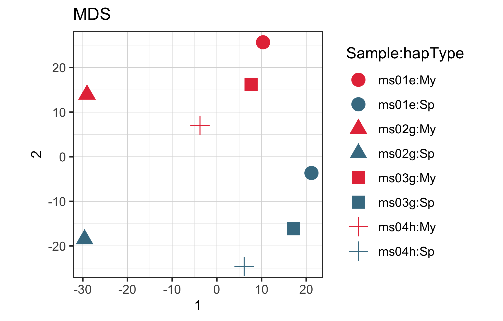
```


### C-04.II : MDS using poission distance

#### Prepare Dataframe for MDS plot with poisson distances
```{r}
mdsPois <- as.data.frame(colData(ASE_Matrix)) %>%
  cbind(cmdscale(samplePoisDistMatrix)) %>%
  mutate(group = paste0(sampleID, ":", hapType))
```

#### GGplot MSD with Poisson Distances
```{r}
grDevices::png(filename = "mds_pois.png",  width = 12.5, height = 8, units = 'cm', res = 400)
  
mds_pois <-  ggplot(mdsPois, aes(x = `1`, y = `2`, color = group, shape = group)) +
  geom_point(size = 4) +
  scale_color_manual("Sample:hapType",
                     values = c("#E63946","#457b92", "#E63946","#457b92", "#E63946","#457b92", "#E63946", "#457b92")) +
  scale_shape_manual("Sample:hapType",
                     values = c(19, 19, 17, 17, 15, 15, 3, 3)) +
  coord_fixed() +
  labs(
    title = "MDS: Poisson distances"
    #y = "",
    #x = ""
  ) +
  theme_bw() + 
  theme(
    panel.grid.major = element_line(colour = 'grey85', size = 0.2),
    panel.grid.minor = element_line(colour = 'grey90', size = 0.1),
    axis.title.x = element_text(size = 10),
    axis.title.y = element_text(size = 10),
    plot.title = element_text(size = 12),
    #legend.position = c(0.8,0.2), #You can adjust legend position here
    #legend.background = element_rect(color = "black")
  )

mds_pois

dev.off()

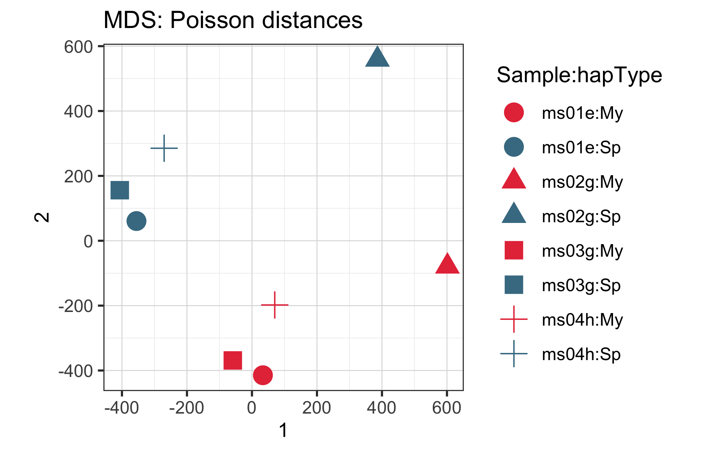
```


## Step C-05: Check genes with high expression for both haplotypes

### Step C-05 I: Prepare data

#### Calculate unqC_Sum quartiles for each of the samples
```{r}
quantsDF <- counts.ForBinom %>%
  group_by(sample) %>%
  summarise(q1 = quantile(unqC_Sum, probs = 0.25),
            q2 = quantile(unqC_Sum, probs = 0.50),
            q3 = quantile(unqC_Sum, probs = 0.75))

quantsDF
```

#### Left join 3rd Quarile threshold and check if unqC_sum (unqC_My + unqC_Sp) lie in the 4th quartile
```{r}
countsWithQuants <- counts.ForBinom %>%
  left_join(quantsDF %>% dplyr::select(sample, q3), by = "sample") %>%
  mutate(high_exp = ifelse(unqC_Sum >= q3, 1, 0))
```

#### See some summary stats
```{r}
countsWithQuants %>% group_by(sample) %>%
  summarise(n = sum(high_exp))
```

#### List of unique genes with high expression for each sample
```{r}
high_exp_01 <- subset(countsWithQuants, sample == "2ms01e" & high_exp == 1)$transcript_ID
high_exp_02 <- subset(countsWithQuants, sample == "2ms02g" & high_exp == 1)$transcript_ID
high_exp_03 <- subset(countsWithQuants, sample == "2ms03g" & high_exp == 1)$transcript_ID
high_exp_04 <- subset(countsWithQuants, sample == "2ms04h" & high_exp == 1)$transcript_ID

#list of lists with genes for each sample
input_high_exp <- list("2ms01e" = high_exp_01, "2ms02g" = high_exp_02, "2ms03g" =high_exp_03, "2ms04h" = high_exp_04)
```


### C-05 II: Venn plot of genes which have overall expression > 3rd quartile

#### Needed package
```{r}
library(ggvenn)
```

#### Venn plot 
```{r}
grDevices::png(filename = "venn_high_exp.png",  width = 12.5, height = 8, units = 'cm', res = 400)

venn_high_exp <-ggvenn(
  input_high_exp, 
  fill_color = c("#0073C2FF", "#EFC000FF", "#868686FF", "#CD534CFF"),
  stroke_size = 0.4, set_name_size = 3, text_size = 3
  )

venn_high_exp

dev.off()

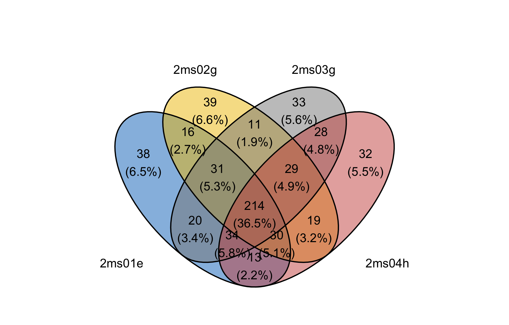
```


# Part D: Binomial Tests

## Step D-01: Run binomial test

```{r}
counts.ForBinom$binom_p = apply(counts.ForBinom[,c("unqC_My", "unqC_Sp")], 
                     1, function(x)binom.test(x[1],x[1]+x[2],p=0.5, alternative = "two.sided")$p.value)
```

## Step D-02: Obtain Results of binomial tests

```{r}
counts.ForBinom$p0.05 <- ifelse(counts.ForBinom$binom_p < 0.05, 1, 0)
counts.ForBinom$p0.01 <- ifelse(counts.ForBinom$binom_p < 0.01, 1, 0)
counts.ForBinom$p0.001 <- ifelse(counts.ForBinom$binom_p < 0.001, 1, 0)
```

# Part E: ASE analyses (modified DESeq method)

## Step E-01: Run the DESeq using the design

```{r}
dds.ASE_Data <- DESeq(ASE_Matrix, fitType = "local", betaPrior = FALSE)
```

## Step E-02: Build the results table

Details: Calling results without any arguments will extract the estimated log2 fold changes and p values for the last variable in the design formula. If there are more than 2 levels for this variable { as is the case in this analysis { results will extract the results table for a comparison of the last level over the first level.

#### Dataset with results
```{r}
# Set "Sp" counts as the reference level
result.ASE_Data <- results(
  dds.ASE_Data, contrast = c("hapType", "My", "Sp"), 
  alpha = 0.05)
```

#### Number of genes with  significant difference (TRUE) and insignificant difference (FALSE)
```{r}
table(result.ASE_Data$padj < 0.1)
summary(result.ASE_Data)
```

## Step E-03 (**Optional): 

If we want to make the sig genes threshold more stricter we can narrow down padj and/or also use higher L2FC


### E-03 I: LFC Threshold == 1 & adjusted p-value < 0.05

#### Obtain results
```{r}
result.ASE_Data.05 <- results(
  dds.ASE_Data, contrast = c("hapType", "My", "Sp"),
  alpha = 0.05, lfcThreshold = 1)
```

#### Summary of the results
```{r}
table(result.ASE_Data.05$padj < 0.05)
summary(result.ASE_Data.05)
```

### E-03 II: LFC Threshold == 1 

(**Optional): If we want the results that have gene expression at least double or halving in My i.e lfc of 1 is 2^1 = 2 (double the expression)

#### Obtain Results
```{r}
result.ASE_Data.LFC1 <- results(dds.ASE_Data, lfcThreshold = 1,
                                contrast = c("hapType", "My", "Sp"))
```

#### Summary of the results
```{r}
table(result.ASE_Data.LFC1$padj < 0.05)
summary(result.ASE_Data.LFC1)
```

## Step E-04: Convert the results table to dataframe.

#### Reslts
```{r}
# Results as dataframe
result.ASE.asDF <- as.data.frame(result.ASE_Data)
result.ASE.LFC1.asDF <- as.data.frame(result.ASE_Data.LFC1)

result.ASE.asDF <- rownames_to_column(
  result.ASE.asDF, var = "transcript_ID")
result.ASE.LFC1.asDF <- rownames_to_column(
  result.ASE.LFC1.asDF , var = "transcript_ID")

head(result.ASE.asDF)
head(result.ASE.LFC1.asDF)
```

## Step E-05: Venn plot comparing general ASE results and ASE results with threshold

Here we check how many genes from general ASE results table inter

#### Prepare data for Venn plot
```{r}
sign_results <- subset(result.ASE.asDF, padj <= 0.001)$transcript_ID
sign_results_lfc1 <-subset(result.ASE.LFC1.asDF, padj <= 0.001)$transcript_ID

input_ase_results <- list("No threshold" = sign_results, "LFC Threshold = 1" = sign_results_lfc1)
```

#### Venn plot
```{r}
grDevices::png(filename = "venn_ase_sign.png",  width = 12.5, height = 8, units = 'cm', res = 400)

venn_ase_sign <- ggvenn(
  input_ase_results, 
  fill_color = c("#0073C2FF", "#EFC000FF"),
  stroke_size = 0.4, set_name_size = 3, text_size = 3
)

venn_ase_sign

dev.off()

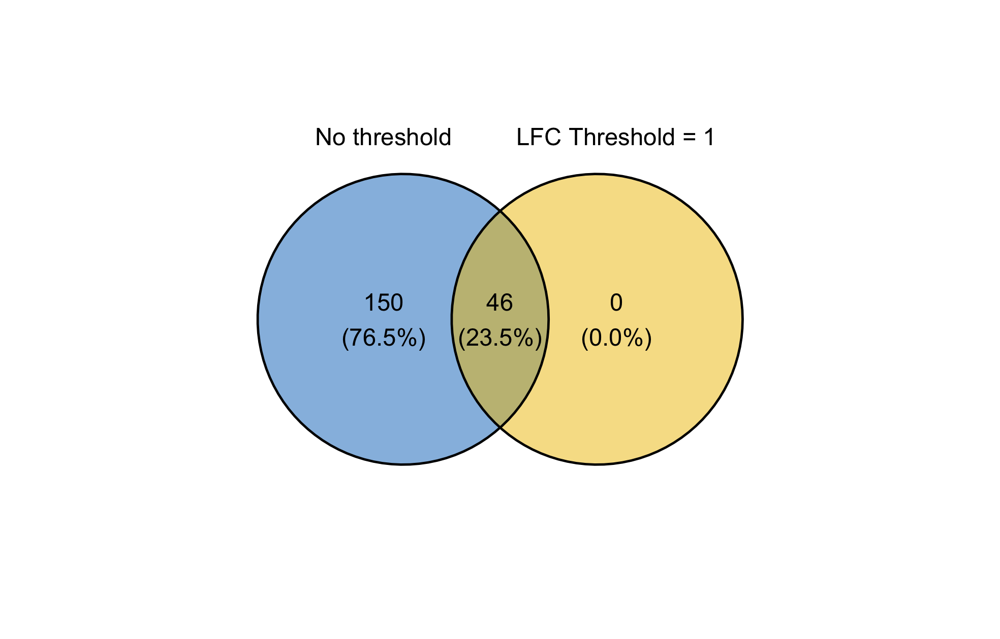
```

Results: basically, the results seem to be obvious. When applying a threshold we simply have lower number of genes with adjusted p-value on the same level.

# Part F: Plotting results

## Step F-01: Before we start plotting we add some extra information to the results table

This extra step helps to add more metadata information to the "results" for better analyses and plotting

### Step F-01.I : update the data/matrix with geneNames, geneID 
 * We can use biomart 
 * Or a simple column merge (by matching row names) - We use this :)

#### create geneMap database
```{r}
geneMap <- counts.ms1e2g3g4h.filt01 %>%
  distinct(start, transcript_ID, .keep_all = TRUE) %>%
  data.frame(row.names = "transcript_ID") %>%
  mutate(
    unqC_My.total = (unqC_My.ms01e + unqC_My.ms02g + unqC_My.ms03g + unqC_My.ms04h),
    unqC_Sp.total = (unqC_Sp.ms01e + unqC_Sp.ms02g + unqC_Sp.ms03g + unqC_Sp.ms04h)) %>%
  select(contig, start, end, gene_Name, gene_ID, unqC_My.total, unqC_Sp.total)
# Note: this geneMap database should have exact same number of rows as "results"
# plus the "rownames" should match between "results" and "geneMap"

head(geneMap)
```


### Step F-01.II :now merge this geneMap with resultsData using row.names match.
```{r}
result.ASE_Data.withGeneMap <- cbind(result.ASE_Data, geneMap)
# Result/Note: this geneMap database should have exact same number of rows as "results"
# plus the "rownames" should match between "results" and "geneMap"
```

#### Just check the number of rows
```{r}
nrow(result.ASE_Data) == nrow(result.ASE_Data.withGeneMap)
```

#### Additionally: make a data frame of geneMap and resultsData from S4 object
```{r}
result.withGeneMap.asDF <- as.data.frame(result.ASE_Data.withGeneMap,
  row.names = rownames(result.ASE_Data.withGeneMap))

result.withGeneMap.asDF <- 
  mutate(result.withGeneMap.asDF, 
         Significance = if_else(padj <= 0.01 & abs(log2FoldChange) >= 4, "|L2FC| > 4 & padj < 0.01", 
                       if_else(padj <= 0.05 & abs(log2FoldChange) >= 2, "|L2FC| > 2 & padj < 0.05", "non-Sig")),
         unqC_total = unqC_My.total + unqC_Sp.total)
```

Now, we start making plot either using "results" table or updated results table

## Step F-02 : Counts plot - using raw counts

Plot of the raw read counts stratified by two haplotypes for specific gene

topGene, PIN1, PIN3, TCP15 - Plot

### Step F-02.I :COunt plot - Top gene (gene with the lowers p-value adjusted)

#### Top gene - DAta
```{r}
topGene.data <- plotCounts(dds.ASE_Data, gene=which.min(result.ASE_Data.withGeneMap$padj),
                intgroup="hapType", returnData=TRUE)
```

#### See which gene it is
```{r}
result.withGeneMap.asDF %>%
  filter(padj == min(padj))
```

#### Top gene - plot
```{r}
grDevices::png(filename = "top_gene.png",  width = 12.5, height = 8, units = 'cm', res = 400)

top_gene <- ggplot(topGene.data, aes(x = hapType, y = count, color = sampleID, group = sampleID)) +
  scale_y_log10() + geom_point(size = 2, position=position_dodge(0.4)) +
  geom_line(position=position_dodge(0.4), size = 1) + 
  labs(title = "Raw counts for the Gene with the least p-vaue", 
       x = "Haplotype", y = "Raw counts") + 
  scale_color_manual("Sample", values = c("#7F58AF", "#64C5EB", "#E84D8A", "#FEB326")) +
  scale_x_discrete(limits = c("Sp", "My")) +
  theme_bw() + 
  theme(axis.text=element_text(size=12),
        axis.title=element_text(size=10),
        plot.title = element_text(size = rel(1)),
        panel.grid.major = element_line(colour = 'grey85', size = 0.2),
        panel.grid.minor = element_line(colour = 'grey90', size = 0.1),
        axis.title.x = element_text(size = 10),
        axis.title.y = element_text(size = 10),
        #legend.position = c(0.8,0.2), #You can adjust legend position here
        #legend.background = element_rect(color = "black")
  )


top_gene

dev.off()

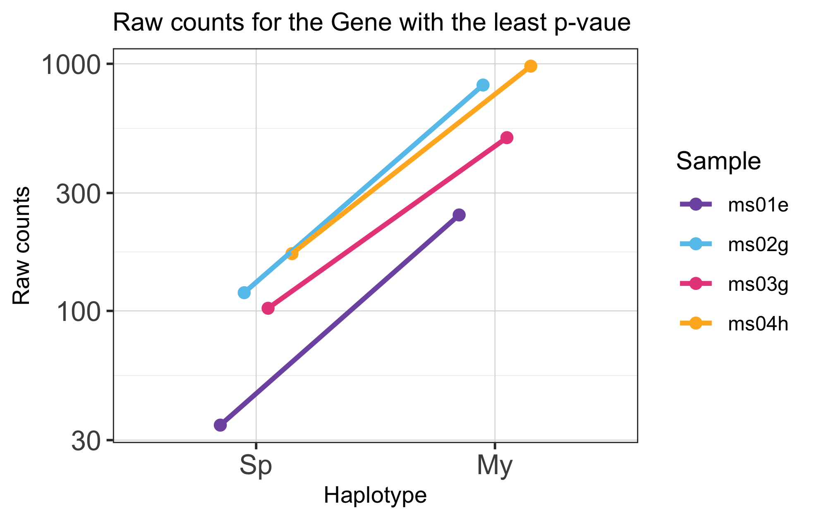
```

Result: this plots the raw counts by Haplotype for the given gene the points are jittered to prevent overlaps the lines are connected between Haplotypes of same samples.


### Step F-02.II: Count plot for PIN3

#### PIN3 - Data
```{r}
d.PIN3 <- plotCounts(
  dds.ASE_Data, 
  gene=which(result.ASE_Data.withGeneMap$gene_Name == "PIN3"), 
  intgroup="hapType", returnData=TRUE)
```

#### PIN3 - Plot
```{r}
grDevices::png(filename = "pin3.png",  width = 12.5, height = 8, units = 'cm', res = 400)

pin3 <- ggplot(d.PIN3, aes(x = hapType, y = count, color = sampleID, group = sampleID)) +
  scale_y_log10() +  geom_point(size = 2, position=position_dodge(0.4)) +
  geom_line(position=position_dodge(0.4), size = 1) + 
  labs(title = "Raw counts for PIN3", 
       x = "Haplotype", y = "Raw counts") + 
  scale_color_manual("Sample", values = c("#7F58AF", "#64C5EB", "#E84D8A", "#FEB326")) +
  theme_bw() + 
  theme(axis.text=element_text(size=12),
        axis.title=element_text(size=10),
        plot.title = element_text(size = rel(1)),
        panel.grid.major = element_line(colour = 'grey85', size = 0.2),
        panel.grid.minor = element_line(colour = 'grey90', size = 0.1),
        axis.title.x = element_text(size = 10),
        axis.title.y = element_text(size = 10),
        #legend.position = c(0.8,0.2), #You can adjust legend position here
        #legend.background = element_rect(color = "black")
  )

pin3

dev.off()

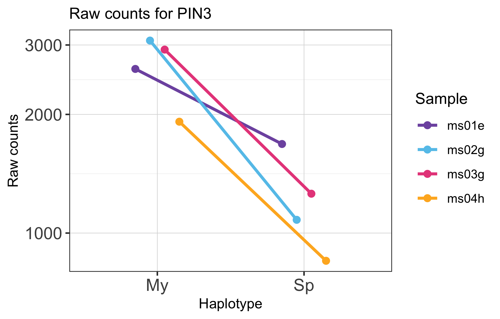
```

#### PIN3 - p-value
```{r}
subset(result.withGeneMap.asDF, gene_Name == "PIN3")$padj
```

### Step F-02.III: Count plot for PIN1

#### PIN1 - Data
```{r}
d.PIN1 <- plotCounts(
  dds.ASE_Data, 
  gene=which(result.ASE_Data.withGeneMap$gene_Name == "PIN1"), 
  intgroup="hapType", returnData=TRUE)
```

#### PIN1 - Plot
```{r}
grDevices::png(filename = "pin1.png",  width = 12.5, height = 8, units = 'cm', res = 400)

pin1 <- ggplot(d.PIN1, aes(x = hapType, y = count, color = sampleID, group = sampleID)) +
  scale_y_log10() +  geom_point(size = 2, position=position_dodge(0.4)) +
  geom_line(position=position_dodge(0.4), size = 1) + 
  labs(title = "Raw counts for PIN1", 
       x = "Haplotype", y = "Raw counts") + 
  scale_color_manual("Sample", values = c("#7F58AF", "#64C5EB", "#E84D8A", "#FEB326")) +
  theme_bw() + 
  theme(axis.text=element_text(size=12),
        axis.title=element_text(size=10),
        plot.title = element_text(size = rel(1)),
        panel.grid.major = element_line(colour = 'grey85', size = 0.2),
        panel.grid.minor = element_line(colour = 'grey90', size = 0.1),
        axis.title.x = element_text(size = 10),
        axis.title.y = element_text(size = 10),
        #legend.position = c(0.8,0.2), #You can adjust legend position here
        #legend.background = element_rect(color = "black")
  )

pin1

dev.off()

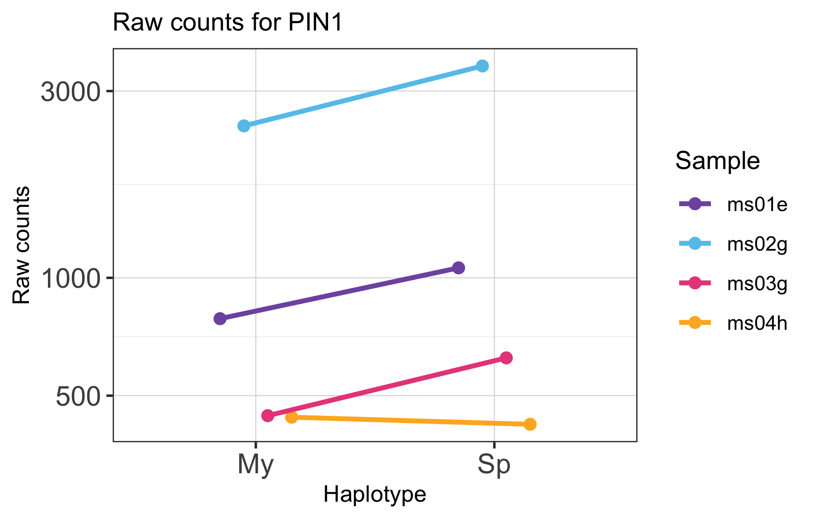
```

#### PIN1 - p-value
```{r}
subset(result.withGeneMap.asDF, gene_Name == "PIN1")$padj
```

### Step F-02.III: Count plot for TCP15

#### TCP15 - Data
```{r}
d.TCP15 <- plotCounts(
  dds.ASE_Data, 
  gene=which(result.ASE_Data.withGeneMap$gene_ID == "AL2G28860"), 
  intgroup="hapType", returnData=TRUE)
```

#### TCP15 - Plot
```{r}
grDevices::png(filename = "tcp15.png",  width = 12.5, height = 8, units = 'cm', res = 400)

tcp15 <- ggplot(d.TCP15, aes(x = hapType, y = count, color = sampleID, group = sampleID)) +
  scale_y_log10() +  geom_point(size = 2, position=position_dodge(0.4)) +
  geom_line(position=position_dodge(0.4), size = 1) + 
  labs(title = "Raw counts for TCP15", 
       x = "Haplotype", y = "Raw counts") + 
  scale_color_manual("Sample", values = c("#7F58AF", "#64C5EB", "#E84D8A", "#FEB326")) +
  scale_x_discrete(limits = c("Sp", "My")) +
  theme_bw() + 
  theme(axis.text=element_text(size=12),
        axis.title=element_text(size=10),
        plot.title = element_text(size = rel(1)),
        panel.grid.major = element_line(colour = 'grey85', size = 0.2),
        panel.grid.minor = element_line(colour = 'grey90', size = 0.1),
        axis.title.x = element_text(size = 10),
        axis.title.y = element_text(size = 10),
        #legend.position = c(0.8,0.2), #You can adjust legend position here
        #legend.background = element_rect(color = "black")
  )

tcp15

dev.off()

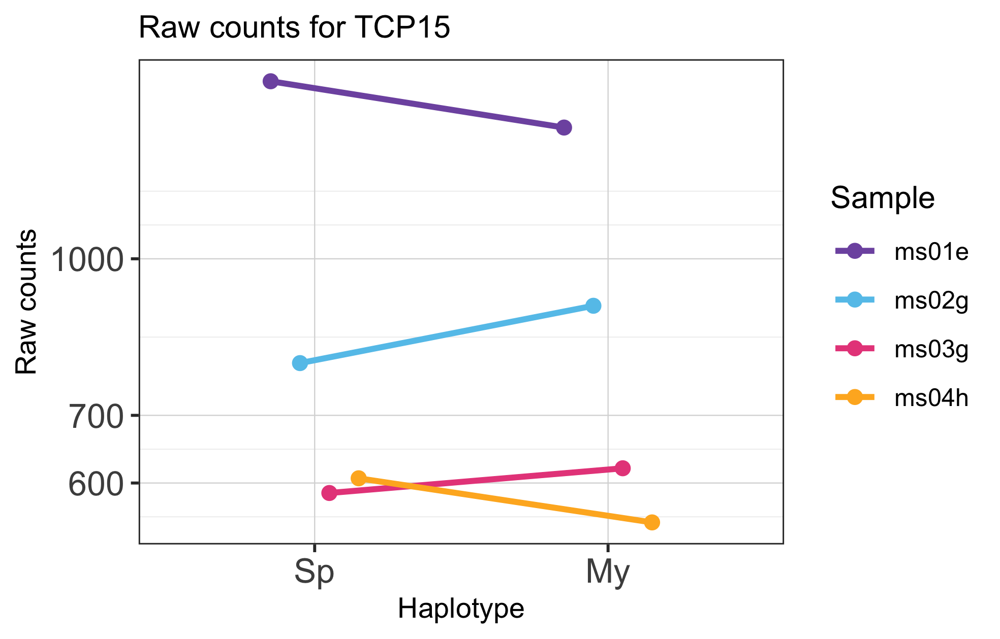
```

#### TCP15 - p-value
```{r}
subset(result.withGeneMap.asDF, gene_ID == "AL2G28860")$padj
```

### F-02 IV: Count plot for TCP22

#### TCP22 - Data
```{r}
d.TCP22 <- plotCounts(
  dds.ASE_Data, 
  gene=which(result.ASE_Data.withGeneMap$gene_ID == "AL2G31640"), 
  intgroup="hapType", returnData=TRUE)
```

#### TCP22 - Plot
```{r}
grDevices::png(filename = "tcp22.png",  width = 12.5, height = 8, units = 'cm', res = 400)

tcp22 <- ggplot(d.TCP22, aes(x = hapType, y = count, color = sampleID, group = sampleID)) +
  scale_y_log10() +  geom_point(size = 2, position=position_dodge(0.4)) +
  geom_line(position=position_dodge(0.4), size = 1) + 
  labs(title = "Raw counts for TCP22", 
       x = "Haplotype", y = "Raw counts") + 
  scale_color_manual("Sample", values = c("#7F58AF", "#64C5EB", "#E84D8A", "#FEB326")) +
  scale_x_discrete(limits = c("Sp", "My")) +
  theme_bw() + 
  theme(axis.text=element_text(size=12),
        axis.title=element_text(size=10),
        plot.title = element_text(size = rel(1)),
        panel.grid.major = element_line(colour = 'grey85', size = 0.2),
        panel.grid.minor = element_line(colour = 'grey90', size = 0.1),
        axis.title.x = element_text(size = 10),
        axis.title.y = element_text(size = 10),
        #legend.position = c(0.8,0.2), #You can adjust legend position here
        #legend.background = element_rect(color = "black")
  )

tcp22

dev.off()

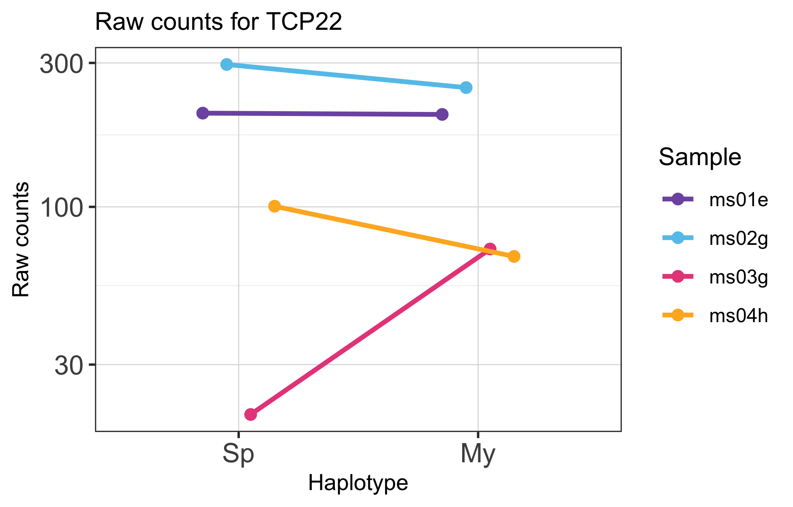
```

#### TCP22 - p-value
```{r}
subset(result.withGeneMap.asDF, gene_ID == "AL2G31640")$padj
```

### F-02 V: Count plot for AP1

#### AP1 - Data
```{r}
d.AP1 <- plotCounts(
  dds.ASE_Data, 
  gene=which(result.ASE_Data.withGeneMap$gene_ID == "AL2G28180"), 
  intgroup="hapType", returnData=TRUE)
```

#### AP1 - Plot
```{r}
grDevices::png(filename = "ap1.png",  width = 12.5, height = 8, units = 'cm', res = 400)

ap1 <- ggplot(d.AP1, aes(x = hapType, y = count, color = sampleID, group = sampleID)) +
  scale_y_log10() +  geom_point(size = 2, position=position_dodge(0.4)) +
  geom_line(position=position_dodge(0.4), size = 1) + 
  labs(title = "Raw counts for AP1", 
       x = "Haplotype", y = "Raw counts") + 
  scale_color_manual("Sample", values = c("#7F58AF", "#64C5EB", "#E84D8A", "#FEB326")) +
  scale_x_discrete(limits = c("Sp", "My")) +
  theme_bw() + 
  theme(axis.text=element_text(size=12),
        axis.title=element_text(size=10),
        plot.title = element_text(size = rel(1)),
        panel.grid.major = element_line(colour = 'grey85', size = 0.2),
        panel.grid.minor = element_line(colour = 'grey90', size = 0.1),
        axis.title.x = element_text(size = 10),
        axis.title.y = element_text(size = 10),
        #legend.position = c(0.8,0.2), #You can adjust legend position here
        #legend.background = element_rect(color = "black")
  )

ap1

dev.off()

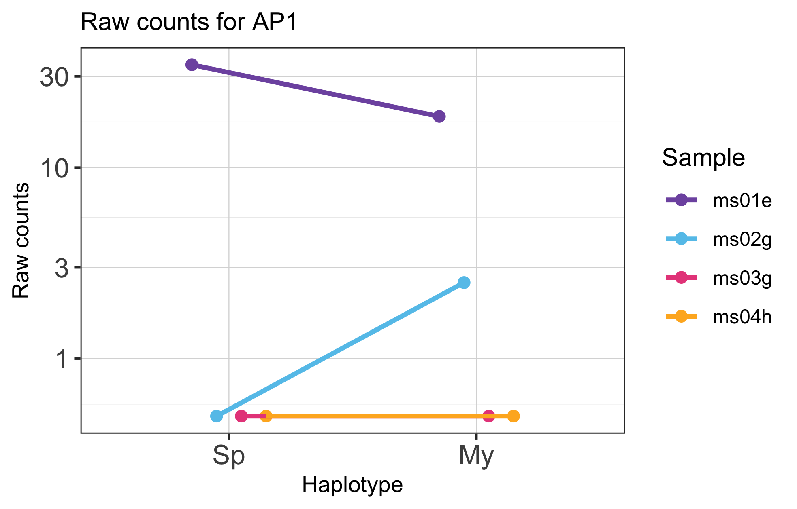
```

#### AP1 - p-value
```{r}
subset(result.withGeneMap.asDF, gene_ID == "AL2G28180")$padj
```


## Step F-03: Prepare Data for Diagnostic Plots

### Step F-03 I. Make significance categories

Here we make categories of genes depending on the Log2FoldChange and p-value adjusted.

The attitude is as follows: 

  * "Lower" - when Log2FoldChange < 0.6 and padj <= 0.05. It means that Sp allele is expressed more than My and the difference is significant.
  * "Upper" - when Log2FoldChange > 0.6 and padj <= 0.05. It means that My allele is expressed more than Sp and the difference is significant.
  * "NS" - means that the difference between allele expression is insignificant.
  
We take < 0.6 and > 0.6 for Log2FoldChange according to this link: https://biocorecrg.github.io/CRG_RIntroduction/volcano-plots.html

In addition, we make separate groups for significance which derived purely according to p-values.

```{r}
# Make a copy of the DESeq2 results table
result.ASE.copy <- result.ASE.asDF

# -Log10 of p-value adjusted
result.ASE.copy$padj_log10 <- -log10(result.ASE.copy$padj)

# Make groups of genes depending on the 
result.ASE.copy <- result.ASE.copy %>%
  mutate(
    cat = case_when(
    log2FoldChange < -0.6 & padj <= 0.05 ~ "Lower",
    log2FoldChange > 0.6 & padj <= 0.05 ~ "Upper",
    TRUE ~ "NS"),
    sign = case_when(
      padj <= 0.001 ~ "< 0.001",
      padj <= 0.01 ~ "< 0.01",
      padj <= 0.05 ~ "< 0.05",
      padj <= 0.1 ~ "< 0.1",
      TRUE ~ "ns")
  )
```

### F-03 II: A brief look on significance categories

#### Check number number of genes in each category
```{r}
# Check categories
knitr::kable(table(result.ASE.copy$cat))
```

#### Check number of genes by significance level

We interpret the table as follows:

| category      | p-value interval |
| ----------- | ----------- |
| < 0.001      | p-value <= 0.001      |
| < 0.01   | 0.001 < p-value <= 0.01  |
| < 0.05   | 0.01 < p-value <= 0.05  |
| < 0.01   | 0.05 < p-value <= 0.1  |
| ns   | p-value > 0.1  |

```{r}
knitr::kable(table(result.ASE.copy$sign))
```

#### Plot the number of genes by significance levels
```{r}
result.ASE.copy %>%
  group_by(sign) %>%
  summarise(n = n()) %>%
  ggplot(aes(x = sign, y = n, fill = sign)) +
  geom_bar(stat = "identity") +
  geom_text(aes(label = n), vjust = 2) +
  labs(x = "Significance level",
       y = "Count") +
  scale_fill_manual("Sign. level",
                    values = c("#457b92", "#6f9baa", "#9abcc4", "#c7dde0", "#9e9e9e")) +
  theme_bw() + 
  theme(
    panel.grid.major = element_line(colour = 'grey85', size = 0.2),
    panel.grid.minor = element_line(colour = 'grey90', size = 0.1),
    axis.title.x = element_text(size = 14),
    axis.title.y = element_text(size = 14),
    plot.title = element_text(size = 16),
    axis.text.x = element_text(angle = 45, hjust=1),
    #legend.position = c(0.8,0.2), #You can adjust legend position here
    #legend.background = element_rect(color = "black")
  )
```


## Step F-04: Diagnostic Plots

### F-04 I: Volcano plot

#### Make a volcano plot
```{r}
grDevices::png(filename = "volc_wald.png",  width = 12.5, height = 8, units = 'cm', res = 400)

# Volcano Plot
volc_wald <- result.ASE.copy %>%
  ggplot(mapping = aes(x = log2FoldChange, y = padj_log10)) +
  geom_point(data = result.ASE.copy %>% filter(cat == "Lower"), aes(color = sign), alpha = 0.9) +
  scale_color_manual("My < Sp", #legend title
                     values = c("#457b92","#7eb1c7","#b8eaff"), #colors for sign_level
                     guide = guide_legend(override.aes = list(size = 4)) #size of the points inside legend
  ) +
  ggnewscale::new_scale_color() + # Need to add new gradient scale
  # Beyond abline
  geom_point(data = result.ASE.copy %>% filter(cat == "Upper"), aes(color = sign), alpha = 0.9) +
  scale_color_manual("My > Sp", 
                     values = c("#E63946","#f98e89","#ffd6d2"),
                     guide = guide_legend(override.aes = list(size = 4))
  ) +
  ggnewscale::new_scale_color() +
  # Not significant
  geom_point(data = result.ASE.copy %>% filter(cat == "NS"), aes(color = "Not sign."), size = 1, alpha = 0.8) +
  scale_color_manual("",values= "#525252", labels = "Not sign.",
                     guide = guide_legend(override.aes = list(size = 4))
  ) +
  #ggnewscale::new_scale_color() +
  labs(x = "Log2 Folds Change",
       y = "-log10 p-value",
       title = "Volcano plot") +
  theme_bw() + 
  theme(
    panel.grid.major = element_line(colour = 'grey85', size = 0.2),
    panel.grid.minor = element_line(colour = 'grey90', size = 0.1),
    axis.title.x = element_text(size = 10),
    axis.title.y = element_text(size = 10),
    plot.title = element_text(size = 12),
    #legend.key = element_rect(color = "black")
    legend.title = element_text(size = 10),
    legend.text = element_text(size = 10),
    legend.spacing.y = unit(0.05, "cm")
  )

volc_wald

dev.off()
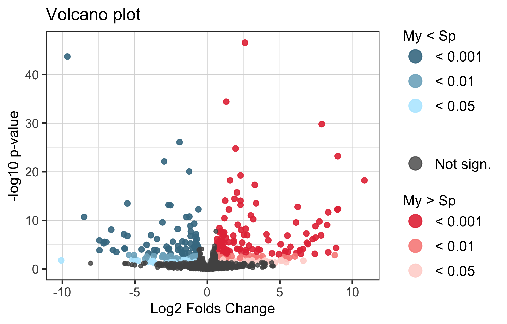
```


### F-04 II: MA-plot (ggpubr version)

#### Upload the package
```{r messages = FALSE}
library(ggpubr)
```

#### Make MA-plot with ggpubr package
```{r}
grDevices::png(filename = "ma_pubr.png",  width = 12.5, height = 8, units = 'cm', res = 400)

ma_pubr <- ggpubr::ggmaplot(result.ASE_Data.withGeneMap, fdr = 0.05, fc = 1.5, size = 0.4,
                 main = "MA plot", legend = "top", top = 20, 
                 palette = c("#B31B21", "#1465AC", "darkgray"),
                 genenames = as.vector(if_else(result.ASE_Data.withGeneMap$padj < 0.001, result.ASE_Data.withGeneMap$gene_Name, NULL)), 
                 font.label = c("bold", 6), font.legend = c("bold", 8), font.main = c("bold", 8),
                 font.x = 8, font.y = 8,
                 ggtheme = ggplot2::theme_bw())

ma_pubr

dev.off()

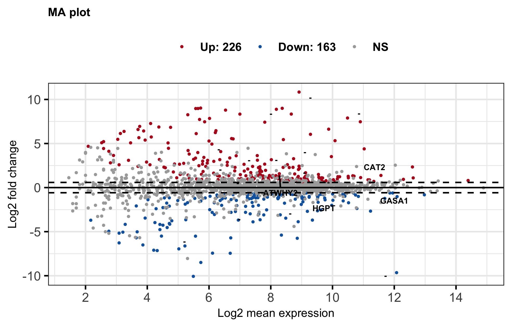
```


### F-04 III: MA-plot (ggplot2 version)
```{r}
grDevices::png(filename = "md_wald.png",  width = 12.5, height = 8, units = 'cm', res = 400)

md_wald <- result.ASE.copy %>%
  ggplot(mapping = aes(y = log2FoldChange, x = baseMean)) +
  geom_point(data = result.ASE.copy %>% filter(cat == "Lower"), aes(color = sign), alpha = 0.9) +
  scale_color_manual("My < Sp", #legend title
                     values = c("#457b92","#7eb1c7","#b8eaff"), #colors for sign_level
                     guide = guide_legend(override.aes = list(size = 4)) #size of the points inside legend
  ) +
  ggnewscale::new_scale_color() + # Need to add new gradient scale
  # Beyond abline
  geom_point(data = result.ASE.copy %>% filter(cat == "Upper"), aes(color = sign), alpha = 0.9) +
  scale_color_manual("My > Sp", 
                     values = c("#E63946","#f98e89","#ffd6d2"),
                     guide = guide_legend(override.aes = list(size = 4))
  ) +
  ggnewscale::new_scale_color() +
  # Not significant
  geom_point(data = result.ASE.copy %>% filter(cat == "NS"), aes(color = "Not sign."), size = 1, alpha = 0.8) +
  scale_color_manual("",values= "#525252", labels = "Not sign.",
                     guide = guide_legend(override.aes = list(size = 4))
  ) +
  #ggnewscale::new_scale_color() +
  labs(y = "Log2 Folds Change",
       x = "Log2 mean expression",
       title = "MA Plot") +
  scale_x_continuous(trans = "log2") +
  theme_bw() + 
  theme(
    panel.grid.major = element_line(colour = 'grey85', size = 0.2),
    panel.grid.minor = element_line(colour = 'grey90', size = 0.1),
    axis.title.x = element_text(size = 10),
    axis.title.y = element_text(size = 10),
    plot.title = element_text(size = 12),
    #legend.key = element_rect(color = "black")
    legend.title = element_text(size = 10),
    legend.text = element_text(size = 10),
    legend.spacing.y = unit(0.05, "cm")
  )

md_wald

dev.off()
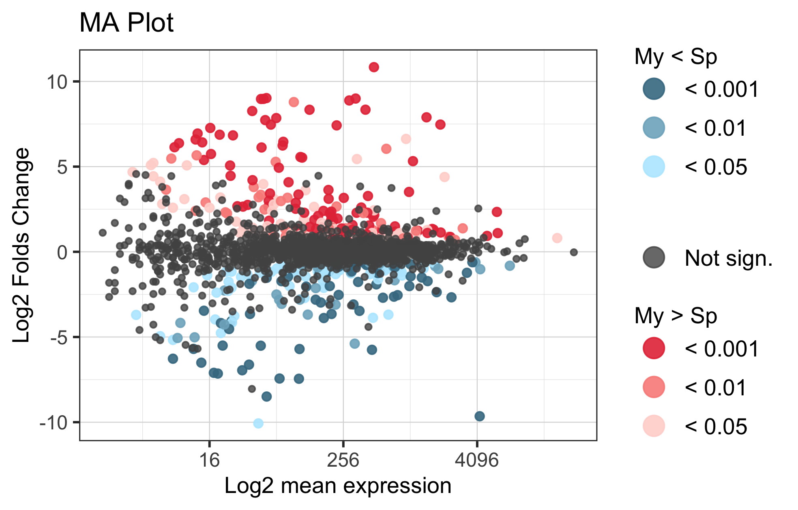
```

### F-04 IV: Additional Plots (not included into the final text)

#### Plot dispersion estimates
```{r}
plotDispEsts(dds.ASE_Data, ylim = c(1e-6, 1e1))
```

#### Histogram of p-values
```{r}
hist( result.ASE_Data.withGeneMap$pvalue, 
      breaks=0:20/20, col="grey50", border = "white", 
      main = "Histogram of p-values", xlab = "p-value")
```

#### Allelic Expression Balance plot

This plot gene expression (log2FoldChanges i.e ASE) by chromosome and genomic position.
Then color the points where the p-adj are significant.

```{r}
ggplot(result.withGeneMap.asDF, aes(x=start, y= log2FoldChange)) +
  labs(title = "Allele Expression Balance Plot: My vs. Sp", x = "Genome Position",
       y = "log2FoldChange: \nMy haplotype vs. Sp haplotype") + 
    theme_bw() +
  theme(plot.title = element_text(hjust = 0.5), legend.position = "bottom") +
  geom_hline(yintercept = c(-4, -2, 2, 4) , 
             color = c("darkgreen", "darkred", "darkred", "darkgreen")) +
  geom_point(aes(x=start, y= log2FoldChange, 
                 color = Significance, shape = Significance, 
                 size = padj), 
             position=position_jitter(w=0.1,h=0)) +
  scale_shape_manual(values=c(3, 4, 5)) #+
  #scale_color_manual(values = c("green", "red", "black"))
```

#### log(XY) plot 

This helps us to show how the log2(unique counts) changes for My haplotype vs. Sp haplotype.
```{r}
ggplot(result.withGeneMap.asDF, aes(x=log2(unqC_Sp.total+1) , y= log2(unqC_My.total+1))) +
  labs(title = "log2 X-Y plot", x = "log2(# of unique Sp haplotype reads + 1)",
       y = "log2(# of unique My haplotype reads + 1)") + 
  theme_bw() +
  theme(plot.title = element_text(hjust = 0.5), legend.position = "bottom") +
  geom_abline(slope =  1, intercept =  0, color = "darkred")+
  geom_point(aes(x=log2(unqC_Sp.total+1) , y= log2(unqC_My.total+1), 
                 color = Significance, shape = Significance, 
                 size = padj),
             position=position_jitter(w=0.1,h=0)) +
  scale_shape_manual(values=c(3, 4, 5)) #+
  #scale_color_manual(name = "legend of significance")
```

#### Manhattan plot
```{r}
ggplot(result.withGeneMap.asDF, aes(x = start, y = -log10(padj))) +
  geom_point(aes(x = start, y = -log10(padj)))
```


## Step F-05: Prepare data for boxplots

### F-05 I: Data for boxplot with top-20 genes by the lowes p-value

#### Additional manipulations with original data
```{r}
counts_2ms01e.joinTest <- counts_2ms01e %>%
  distinct(transcript_ID, .keep_all = TRUE)

counts_2ms02g.joinTest <- counts_2ms02g %>%
  distinct(transcript_ID, .keep_all = TRUE)

counts_2ms03g.joinTest <- counts_2ms03g %>%
  distinct(transcript_ID, .keep_all = TRUE)

counts_2ms04h.joinTest <- counts_2ms04h %>%
  distinct(transcript_ID, .keep_all = TRUE)
```


#### Get the data with all sample combined together (no filters applied)
```{r}
# Union samples verically
data_all <- rbind(counts_2ms01e.joinTest,
                  counts_2ms02g.joinTest,
                  counts_2ms03g.joinTest,
                  counts_2ms04h.joinTest)

# Get the variable which represent the QTL region
data_all <- data_all %>% 
  mutate(unqC_Sum = unqC_My + unqC_Sp,
         qtl_pos = ifelse(start >= 12875963 & start <= 16344528, 1, 0))
```

#### Get the maximum allele expression (between both Sp and My) for each gene

This data will than be used for labelling genes.
```{r}
max_exp <- data_all %>%
  select(transcript_ID, gene_ID, unqC_My, unqC_Sp) %>%
  pivot_longer(c(unqC_My, unqC_Sp), names_to = "allele", values_to = "exp") %>%
  group_by(transcript_ID) %>%
  summarise(max_exp = max(exp))
```

#### Obtain top-20 genes by adjusted Wald-test p-value 
```{r}
genes_20 <- result.withGeneMap.asDF %>%
  arrange(padj) %>%
  select(gene_ID, start, padj) %>%
  tibble::rownames_to_column("transcript_ID") %>%
  head(20) %>%
  left_join(max_exp, by = "transcript_ID") %>%
  mutate(max_log = log2(max_exp + 1) + 1,
         qtl_pos = ifelse(start >= 12875963 & start <= 16344528, 1, 0)) %>% 
  arrange(start)
```

#### Prepare data for boxplot with top-20 genes
```{r}
data_bx_20 <- data_all %>% 
  filter(gene_ID %in% genes_20$gene_ID) %>%
  select(transcript_ID, gene_ID, start, unqC_My, unqC_Sp) %>%
  pivot_longer(c(unqC_My, unqC_Sp), names_to = "allele", values_to = "exp") %>%
  mutate(log_exp = log2(exp + 1), 
         qtl_pos = ifelse(start >= 12875963 & start <= 16344528, 1, 0))

genes_20_table <- data_all %>%
  filter(gene_ID %in% genes_20$gene_ID) %>%
  select(transcript_ID, unqC_My, unqC_Sp) %>%
  group_by(transcript_ID) %>%
  summarise(mean_My = mean(unqC_My),
            sd_My = sd(unqC_My), 
            mean_Sp = mean(unqC_Sp),
            sd_Sp = sd(unqC_Sp)) %>%
  left_join(result.withGeneMap.asDF %>% 
              tibble::rownames_to_column("transcript_ID") %>%
              select(transcript_ID, gene_ID, padj, start),
            by = "transcript_ID") %>%
  mutate(qtl_pos = ifelse(start >= 12875963 & start <= 16344528, 1, 0))
```

### F-05 II: Data for boxplot for Big Boxplot №1 (genes with p-value < 0.001)

In the part F-05 II and following parts F-05 III and F-05 IV we build "Big Boxplots". These boxplots contain all the genes which follow a specific condidition of significance for difference in allele expression. 

This critereas:
  * Big Boxplot №1 - all the genes which have Wald-test p-value < 0.001
  * Big Boxplot №2 - all the genes which are in category: |L2FC| > 2 & padj < 0.05
  * Big Boxplot №3 - all the genes which are in category: |L2FC| > 4 & padj < 0.01

#### Colors for coloring some separate boxplots
```{r}
colors <- c("#00A5E3", "#8DD7BF", "#FF96C5", "#FF5768", "#FFBF65", "#00B0BA")
```

#### Get the data for Big Boxplot №1 (genes with p-value < 0.001)
```{r}
genes_1 <- result.withGeneMap.asDF %>%
  filter(padj <= 0.001) %>%
  select(gene_ID, start, padj) %>%
  tibble::rownames_to_column("transcript_ID") %>%
  left_join(max_exp, by = "transcript_ID") %>%
  mutate(max_log = log2(max_exp + 1) + 1,
         qtl_pos = ifelse(start >= 12875963 & start <= 16344528, 1, 0)) %>% 
  arrange(start)

data_bigbx1 <- data_all %>% 
  filter(transcript_ID %in% genes_1$transcript_ID) %>%
  select(transcript_ID, gene_ID, start, unqC_My, unqC_Sp, unqC_Sum) %>%
  #pivot_longer(c(unqC_My, unqC_Sp), names_to = "allele", values_to = "exp") %>%
  mutate(
    #log_exp = log2(exp + 1), 
    qtl_pos = ifelse(start >= 12875963 & start <= 16344528, 1, 0))
```

#### Get the data for boxplots with high maximum expression (withing both Sp and My)
Threshold in this case was chosen visually to keep only five boxplots filled with color for each of the plots.The same approach works for the other two big boxplots. 
```{r}
gene_names1 <- data_bigbx1 %>%
  group_by(start, gene_ID) %>%
  dplyr::summarise(max = max(unqC_Sum)) %>%
  filter(max > 9000)

high_boxplots1 <- data_bigbx1 %>%
  group_by(start, gene_ID) %>%
  filter(max(unqC_Sum) > 9000)
```

### F-05 III: Data for boxplot for Big Boxplot №2 (category = |L2FC| > 2 & padj < 0.05)

#### Prepare data for the boxplot
```{r}
genes_2 <- result.withGeneMap.asDF %>%
  filter(Significance == "|L2FC| > 2 & padj < 0.05") %>%
  select(gene_ID, start, padj) %>%
  tibble::rownames_to_column("transcript_ID") %>%
  left_join(max_exp, by = "transcript_ID") %>%
  mutate(max_log = log2(max_exp + 1) + 1,
         qtl_pos = ifelse(start >= 12875963 & start <= 16344528, 1, 0)) %>% 
  arrange(start)

data_bigbx2 <- data_all %>% 
  filter(transcript_ID %in% genes_2$transcript_ID) %>%
  select(transcript_ID, gene_ID, start, unqC_My, unqC_Sp, unqC_Sum) %>%
  #pivot_longer(c(unqC_My, unqC_Sp), names_to = "allele", values_to = "exp") %>%
  mutate(
    #log_exp = log2(exp + 1), 
    qtl_pos = ifelse(start >= 12875963 & start <= 16344528, 1, 0))
```

#### Prepare data for the colored boxplots
```{r}
gene_names2 <- data_bigbx2 %>%
  group_by(start, gene_ID) %>%
  dplyr::summarise(max = max(unqC_Sum)) %>%
  filter(max > 3700)

high_boxplots2 <- data_bigbx2 %>%
  group_by(start, gene_ID) %>%
  filter(max(unqC_Sum) > 3700)
```

### F-05 IV: Data for boxplot for Big Boxplot №3 (category = |L2FC| > 4 & padj < 0.01)

#### Prepare Data for the boxplot
```{r}
genes_3 <- result.withGeneMap.asDF %>%
  filter(Significance == "|L2FC| > 4 & padj < 0.01") %>%
  select(gene_ID, start, padj) %>%
  tibble::rownames_to_column("transcript_ID") %>%
  left_join(max_exp, by = "transcript_ID") %>%
  mutate(max_log = log2(max_exp + 1) + 1,
         qtl_pos = ifelse(start >= 12875963 & start <= 16344528, 1, 0)) %>% 
  arrange(start)

data_bigbx3 <- data_all %>% 
  filter(transcript_ID %in% genes_3$transcript_ID) %>%
  select(transcript_ID, gene_ID, start, unqC_My, unqC_Sp, unqC_Sum) %>%
  #pivot_longer(c(unqC_My, unqC_Sp), names_to = "allele", values_to = "exp") %>%
  mutate(
    #log_exp = log2(exp + 1), 
    qtl_pos = ifelse(start >= 12875963 & start <= 16344528, 1, 0))
```


#### Prepare data for the colored boxplots
```{r}
gene_names3 <- data_bigbx3 %>%
  group_by(start, gene_ID) %>%
  dplyr::summarise(max = max(unqC_Sum)) %>%
  filter(max > 2100)

high_boxplots3 <- data_bigbx3 %>%
  group_by(start, gene_ID) %>%
  filter(max(unqC_Sum) > 2100)
```

## Step F-06: Plot Boxplots

### F-06 I: Boxplot - top 20 genes

```{r}
grDevices::png(filename = "bx_20_v2.png",  width = 16.5, height = 10, units = 'cm', res = 400)

bx_20_v2 <- data_bx_20 %>%
  ggplot(mapping = aes(x = as.factor(start), y = log_exp, fill = as.factor(qtl_pos))) +
  geom_boxplot(alpha = 0.3) +
  geom_point(aes(color = allele),
             #position = position_jitter(),
             size = 1.3) +
  stat_summary(fun.y=mean, geom="point", shape=20, size=4, color="#FFA500", fill="#FFA500") +
  scale_color_manual("Haplotype",
                     values = c("#E63946", "#457b92"),
                     labels = c("My", "Sp")) +
  scale_fill_manual("QTL region", values = c("White", "#00A86B"),
                    labels = c("out", "in")) +
  scale_x_discrete(labels = genes_20$gene_ID) +
  labs(
    #title = "Top 20 genes with highest gene expression",
    y = "Log2(Expression + 1)",
    x = "Gene ID"
  ) +
  theme_bw() + 
  theme(
    panel.grid.major = element_line(colour = 'grey85', size = 0.2),
    panel.grid.minor = element_line(colour = 'grey90', size = 0.1),
    axis.title.x = element_blank(),
    axis.title.y = element_text(size = 10),
    plot.title = element_blank(),
    axis.text.x = element_text(angle = 45, hjust=1),
    #legend.position = c(0.8,0.2), #You can adjust legend position here
    legend.background = element_rect(color = "black"),
    legend.title = element_text(size = 8),
    legend.text = element_text(size = 8)
  )

bx_20_v2

dev.off()

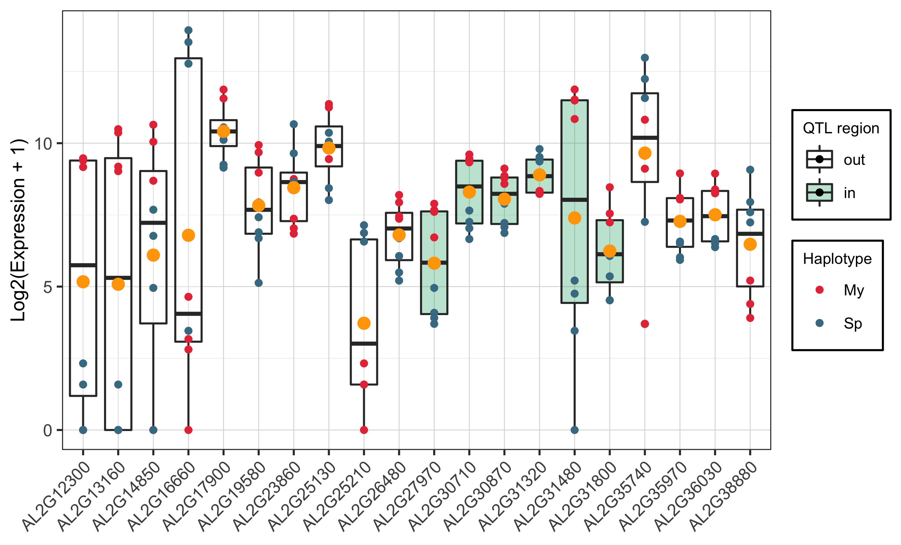
```

### F-06 II: Big Boxplot №1 (genes with p-value < 0.001)
```{r}
grDevices::png(filename = "bx_big1.png",  width = 16.5, height = 10, units = 'cm', res = 400)

bx_big1 <- data_bigbx1 %>%
  ggplot(mapping = aes(x = as.factor(start), y = unqC_Sum)) +
  geom_boxplot() +
  geom_boxplot(data = high_boxplots1, aes(x = as.factor(start), y = unqC_Sum, fill = gene_ID, color = gene_ID),
              show.legend = FALSE) +
  geom_point(data = data_bigbx1 %>% filter(qtl_pos == 1), aes(x = as.factor(start), y = 17500), shape = 15,
             size = 2.5, color = "#00A86B", fill = "#00A86B") +
  annotate("label", label = "QTL region", y = 18500, x = "14891953", size = 3) +
  #geom_rect(aes(xmin= as.factor("12875963"), xmax= as.factor("16344528"), ymin=0, ymax=Inf), alpha = 0.5) +
  #geom_segment(aes(x = "12875963", y = 0, xend = "12875963", yend = 17500)) +
  #scale_x_discrete(labels = levels(factor(data_bigbx1$gene_ID))) +
  scale_x_discrete(labels = levels(factor(data_bigbx1$gene_ID)),
                   guide = guide_axis(check.overlap = TRUE)
                   ) +
  scale_fill_manual(values = colors) +
  scale_color_manual(values = colors) +
  ggrepel::geom_label_repel(data = gene_names1, aes(x = as.factor(start), y = max, label = gene_ID, fill = gene_ID),
                            hjust = -0.2,
                            show.legend = FALSE) +
  labs(y = "Total Gene expression") +
  theme_bw() + 
  theme(
    #panel.grid.major = element_line(colour = 'grey85', size = 0.2),
    #panel.grid.minor = element_line(colour = 'grey90', size = 0.1),
    axis.title.x = element_blank(),
    axis.title.y = element_text(size = 10),
    #axis.title.y = element_blank(),
    plot.title = element_text(size = 10),
    axis.text.x = element_text(angle = 45, hjust=1),
    #legend.position = c(0.8,0.2), #You can adjust legend position here
    legend.background = element_rect(color = "black")
  )

bx_big1

dev.off()

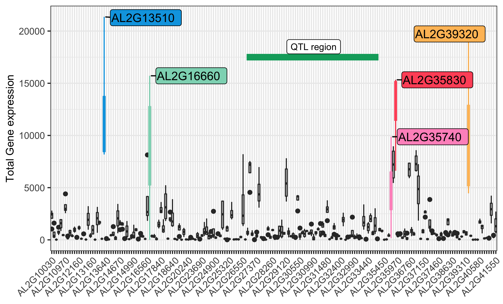
```

### F-06 III: Big Boxplot №2 (category = |L2FC| > 2 & padj < 0.05)
```{r}
grDevices::png(filename = "bx_big2.png",  width = 16.5, height = 10, units = 'cm', res = 400)

bx_big2 <- data_bigbx2 %>%
  ggplot(mapping = aes(x = as.factor(start), y = unqC_Sum)) +
  geom_boxplot() +
  geom_boxplot(data = high_boxplots2, aes(x = as.factor(start), y = unqC_Sum, fill = gene_ID, color = gene_ID),
               show.legend = FALSE) +
  geom_point(data = data_bigbx2 %>% filter(qtl_pos == 1), aes(x = as.factor(start), y = 17500), shape = 15,
             size = 2.5, color = "#00A86B", fill = "#00A86B") +
  annotate("label", label = "QTL region", y = 18500, x = "14795486", size = 3) +
  #geom_rect(aes(xmin= as.factor("12875963"), xmax= as.factor("16344528"), ymin=0, ymax=Inf), alpha = 0.5) +
  #geom_segment(aes(x = "12875963", y = 0, xend = "12875963", yend = 17500)) +
  #scale_x_discrete(labels = levels(factor(data_bigbx1$gene_ID))) +
  scale_x_discrete(labels = levels(factor(data_bigbx2$gene_ID)),
                   guide = guide_axis(check.overlap = TRUE)
  ) +
  scale_fill_manual(values = colors) +
  scale_color_manual(values = colors) +
  ggrepel::geom_label_repel(data = gene_names2, aes(x = as.factor(start), y = max, label = gene_ID, fill = gene_ID),
                            hjust = -0.2,
                            show.legend = FALSE) +
  labs(y = "Total Gene expression") +
  theme_bw() + 
  theme(
    #panel.grid.major = element_line(colour = 'grey85', size = 0.2),
    #panel.grid.minor = element_line(colour = 'grey90', size = 0.1),
    axis.title.x = element_blank(),
    axis.title.y = element_text(size = 10),
    #axis.title.y = element_blank(),
    plot.title = element_text(size = 10),
    axis.text.x = element_text(angle = 45, hjust=1),
    #legend.position = c(0.8,0.2), #You can adjust legend position here
    legend.background = element_rect(color = "black")
  )

bx_big2

dev.off()

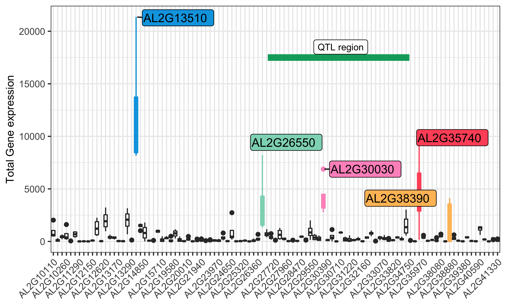
```

### F-06 III: Big Boxplot №2 (category = |L2FC| > 4 & padj < 0.01)
```{r}
grDevices::png(filename = "bx_big3.png",  width = 16.5, height = 10, units = 'cm', res = 400)

bx_big3 <- data_bigbx3 %>%
  ggplot(mapping = aes(x = as.factor(start), y = unqC_Sum)) +
  geom_boxplot() +
  geom_boxplot(data = high_boxplots3, aes(x = as.factor(start), y = unqC_Sum, fill = gene_ID, color = gene_ID),
               show.legend = FALSE) +
  geom_point(data = data_bigbx3 %>% filter(qtl_pos == 1), aes(x = as.factor(start), y = 10000), shape = 15,
             size = 2.5, color = "#00A86B", fill = "#00A86B") +
  annotate("label", label = "QTL region", y = 11000, x = "14635146", size = 3) +
  #geom_rect(aes(xmin= as.factor("12875963"), xmax= as.factor("16344528"), ymin=0, ymax=Inf), alpha = 0.5) +
  #geom_segment(aes(x = "12875963", y = 0, xend = "12875963", yend = 17500)) +
  #scale_x_discrete(labels = levels(factor(data_bigbx1$gene_ID))) +
  scale_x_discrete(labels = levels(factor(data_bigbx3$gene_ID)),
                   guide = guide_axis(check.overlap = TRUE)
  ) +
  scale_fill_manual(values = colors) +
  scale_color_manual(values = colors) +
  ggrepel::geom_label_repel(data = gene_names3, aes(x = as.factor(start), y = max, label = gene_ID, fill = gene_ID),
                            hjust = -0.2,
                            show.legend = FALSE) +
  labs(y = "Total Gene expression") +
  theme_bw() + 
  theme(
    #panel.grid.major = element_line(colour = 'grey85', size = 0.2),
    #panel.grid.minor = element_line(colour = 'grey90', size = 0.1),
    axis.title.x = element_blank(),
    axis.title.y = element_text(size = 10),
    #axis.title.y = element_blank(),
    plot.title = element_text(size = 10),
    axis.text.x = element_text(angle = 45, hjust=1),
    #legend.position = c(0.8,0.2), #You can adjust legend position here
    legend.background = element_rect(color = "black")
  )

bx_big3

dev.off()

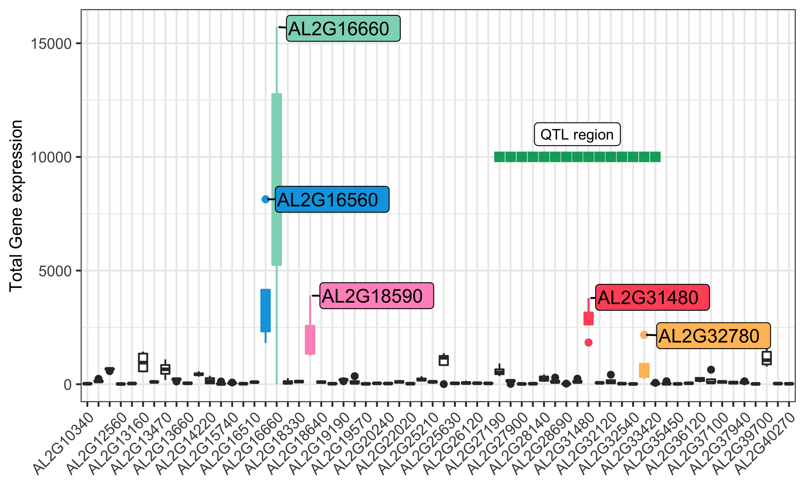
```

# Part G: Test QTL region

## Step G-01: Compare QTL region with 3 other regions

### G-01 I: Make a column for regions
```{r}
result.withRegions <- result.withGeneMap.asDF %>%
  mutate(region = case_when(
    start <  12875963/2 ~ "1",
    start <  12875963 ~ "2",
    start <  16344528 ~ "QTL",
    TRUE ~ "3"))
```

### G-01 II: Compare results by significance groups (from "Upper"/"Lower"/"Non-sig" categoies)

We treat gene as having significant difference if it is not from "Non-sig" category

Variables:
  * num_sig = 1 if gene expression difference is significant, 0 - otherwise
  * n - number of genes in the region
  * mean total - average gene expression (mean unqC_total)
  * sum_num_sig - number of significant genes in the region
  * perc_sig - percent of significant genes from the overall number of genes in the region

```{r}
resultsRegionsCat <- result.withRegions %>% 
  mutate(num_sig = ifelse(Significance == "non-Sig",0,1)) %>%
  group_by(region) %>%
  summarise(n = n(),
            mean_total = mean(unqC_total),
            sum_num_sig = sum(num_sig)) %>%
    mutate(perc_sig = sum_num_sig/n)

resultsRegionsCat
```

### G-01 III: Compare results by significance groups (depend only on adjusted p-value)

We treat gene as having significant difference if its adjusted p-value < 0.001
```{r}
resultsRegionsPadj <- result.withRegions %>% 
  mutate(num_sig = ifelse(padj < 0.001 ,1,0)) %>%
  group_by(region) %>%
  summarise(n = n(),
            mean_total = mean(unqC_total),
            sum_num_sig = sum(num_sig)) %>%
  mutate(perc_sig = sum_num_sig/n)

resultsRegionsPadj
```

### G-01 IV: Run Chi-squared tests

Tests compare whether proportions in sample differ.

All the analysis checks the proportions of significant genes obtained by adjusted p-value (< 0.001)
```{r}
check_prop <- resultsRegionsPadj$perc_sig[4] #Exected proportion

chisq.test(c(56, 449-56), p = c(check_prop, 1-check_prop))$p.value #Region 1
chisq.test(c(31, 276-31), p = c(check_prop, 1-check_prop))$p.value #Region 2
chisq.test(c(53, 516-53), p = c(check_prop, 1-check_prop))$p.value #Region 3
```

There is no case when  Chisq test p-value is less than 0.05. Hence, we cannot reject the null hypothesis about the 0 difference. 

## Step G-02: Compare QTL region with random samples of equal size

### G-02 I: Get the data outside of the QTL region as a separate dataframe
```{r}
resultsOutQTL <- result.withRegions %>% filter(region != "QTL") %>%
  mutate(num_sig = ifelse(padj < 0.001, 1, 0))
```

### G-02 II: Run Chisq test for 10000 random samples

Random samples from this part do not take into account actual genomic positions. For each iteration of the loop random genes are taken to form a dataset. Then the proportion if significant genes is calculated and checked whether it significantly differs from the expected proportions (which is an actual proportion which we obtained for the QTL region).

Then we calculate a share of samples with significantly different proportions of significant genes.

#### Run the loop
```{r}
# Prepare dataframe to take loop records.
df_test<- as.data.frame(matrix(nrow = 10000, ncol = 3))
df_test <- df_test %>% 
  dplyr::rename(num_sig = V1,
         prop = V2, 
         p.value = V3)

set.seed(256)

for (i in 1:10000) {
  df_i <- resultsOutQTL[sample(nrow(resultsOutQTL), 520), ]
  n_sig <- sum(df_i$num_sig == 1)
  n_unsig <- sum(df_i$num_sig == 0)
  df_test$num_sig[i] <- n_sig
  df_test$prop[i] <- n_sig/nrow(df_i)
  df_test$p.value[i] <- chisq.test(c(n_sig, n_unsig), p = c(check_prop, 1 - check_prop))$p.value
}
```

#### Get the share of sample where proportion of significant genes differs from the QTL region
```{r}
sum(df_test$p.value < 0.05)/10000
```

The result is less than 5%, so we can conclude that proportion of significant genes does really differ from the latter dataset.

#### Check regions with significant difference in proportions whether this proportion was larger or smaller

1 - proportion of significant genes in QTL region is larger than in random sample
0 - otherwise
```{r}
df_test_sig <- df_test %>% filter(p.value < 0.05) %>%
  mutate(compare = ifelse(prop < check_prop, 1, 0))

df_test_sig %>% group_by(compare) %>%
  summarise(n =n())
```

Result: we can see that even if there was a signigicant difference in the proportion of significant genes, in most of the cases this proportion was larger than in QTL region.

### G-02 III: Histogram of obtained proportions
```{r}
grDevices::png(filename = "chi_hist.png",  width = 12.5, height = 8, units = 'cm', res = 400)

chi_hist <- df_test %>%
  ggplot(aes(x = prop)) +
  geom_histogram(bins = 15, fill = "#58508d", alpha = 0.9) +
  geom_vline(xintercept = check_prop, color = "red", size = 1) +
  scale_x_continuous() +
  annotate("label", label = "Expected proportion\n0.108",
           x= 0.09 , y = 2000, size = 3) +
  annotate("segment", x = 0.099, y = 2000,
           xend = check_prop, yend = 2000,
           arrow = arrow(length = unit(0.1, "cm"), type = "closed"), 
           lineend = "butt", linejoin = "mitre",
           size = 0.6) +
  theme_bw() + 
  theme(
    panel.grid.major = element_line(colour = 'grey85', size = 0.2),
    panel.grid.minor = element_line(colour = 'grey90', size = 0.1),
    axis.title.x = element_blank(),
    axis.title.y = element_blank(),
    plot.title = element_blank(),
    axis.text.x = element_text(angle = 45, hjust=1),
    #legend.position = c(0.8,0.2), #You can adjust legend position here
    legend.background = element_rect(color = "black"),
    legend.title = element_text(size = 8),
    legend.text = element_text(size = 8)
  )

chi_hist

dev.off()

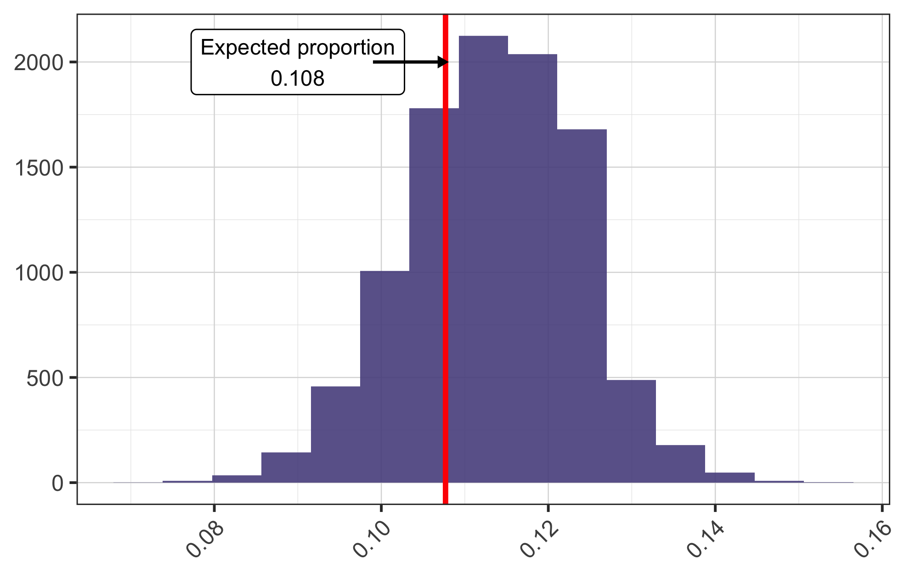
```

We can see that mostly the proportions of significant genes tend to be higher than proportion from the QTL region.

## Step G-03: Compare QTL region with samples of equal size ordered by genomic position

In this part we make samples of equal size which are go before the QTL region by genomic position. The region after the QTL has only 516 genes which were already check by the Chisq test. But we would like to know whether there is an interval of 520 genes which could have significantly different proportion of significant genes.


### G-03 I: Prepare a dataframe with genes outside of QTL regions arranged be genomic position
```{r}
# Arrange genes outside of qtl region by genomic position
resultsSortedOutQTL <- resultsOutQTL %>%
  arrange(start)

# Calculate the number of genes before the start of QTL region
check_rows <- sum(resultsSortedOutQTL$start < 12875963)
```


### G-03 II: Run Chisq test for all 520 gene size samples before QTL region

All in all there 206 samples of 520 genes before the QTL region.

#### Run the loop
```{r}
# Prepare a dataframe for loop records
df_test_2<- as.data.frame(matrix(nrow = check_rows - 520 + 1, ncol = 3))

df_test_2 <- df_test_2 %>% 
  dplyr::rename(num_sig = V1,
                prop = V2, 
                p.value = V3)

# Loop
for (i in 1:(check_rows-520+1)) {
  df_i2 <- resultsSortedOutQTL[i:(i+519),]
  n_sig2 <- sum(df_i2$num_sig == 1)
  n_unsig2 <- sum(df_i2$num_sig == 0)
  df_test_2$num_sig[i] <- n_sig2
  df_test_2$prop[i] <- n_sig2/nrow(df_i2)
  df_test_2$p.value[i] <- chisq.test(c(n_sig2, n_unsig2), p = c(check_prop, 1 - check_prop))$p.value
}
```

#### Get the share of samples where proportion of significant genes differs from the QTL region
```{r}
sum(df_test_2$p.value < 0.05)
```

Result: there are no regions of equal size before the QTL regions which have significantly different number of significant genes.

### G-03 III: Histogram of obtained proportions

```{r}
grDevices::png(filename = "chi_hist_2.png",  width = 12.5, height = 8, units = 'cm', res = 400)

chi_hist_2 <- df_test_2 %>%
  ggplot(aes(x = prop)) +
  geom_histogram(#bins = 15,
                 fill = "#58508d", alpha = 0.9) +
  geom_vline(xintercept = check_prop, color = "red", size = 1) +
  scale_x_continuous(limits = c(0.085,0.13)) +
  annotate("label", label = "Expected proportion\n0.108",
           x= 0.0927 , y = 40, size = 3) +
  annotate("segment", x = 0.099, y = 40,
           xend = check_prop, yend = 40,
           arrow = arrow(length = unit(0.1, "cm"), type = "closed"), 
           lineend = "butt", linejoin = "mitre",
           size = 0.6) +
  theme_bw() + 
  theme(
    panel.grid.major = element_line(colour = 'grey85', size = 0.2),
    panel.grid.minor = element_line(colour = 'grey90', size = 0.1),
    axis.title.x = element_blank(),
    axis.title.y = element_blank(),
    plot.title = element_blank(),
    axis.text.x = element_text(angle = 45, hjust=1),
    #legend.position = c(0.8,0.2), #You can adjust legend position here
    legend.background = element_rect(color = "black"),
    legend.title = element_text(size = 8),
    legend.text = element_text(size = 8)
  )

chi_hist_2

dev.off()

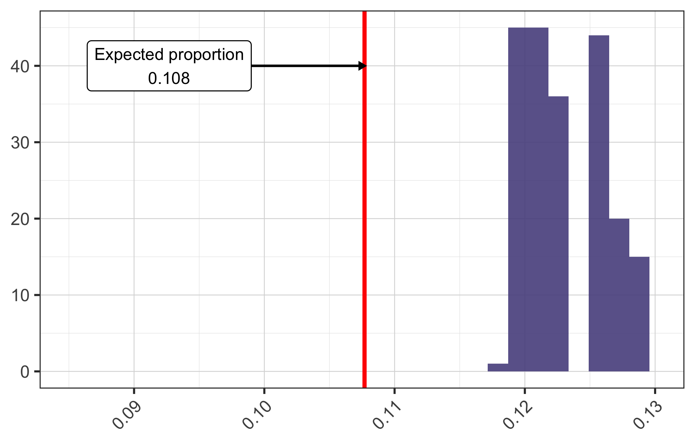
```

At the same time, we can cleaely see that in all cases the proportions of significant genes a higher, than that of QTL regions.

# Part H: Karyoplot

#### Upload useful packages
```{r message=FALSE}
library(karyoploteR)
library(Biostrings)
```

## Step H-01: Prepare data

#### Upload lyrata_genome
```{r}
lyr.chr <- fasta.index("lyrata_genome.fa") #%>% head(5)
typeof(lyr.chr)
```

#### select required rows and then add a mutant column
```{r}
lyr.chr <- lyr.chr %>% 
  dplyr::select(desc, seqlength) %>%
  dplyr::mutate(chrom = base::strsplit(desc, " "))
```

#### Select columns
```{r}
# only select the first element of the mutant column
lyr.chr$chrom <- base::sapply(lyr.chr$chrom, `[`, 1)

# again select only required columns
lyr.chr <- lyr.chr %>% 
  dplyr::select(chrom, seqlength)
```
 
#### replace the word "scaffold_" with null string
```{r}
lyr.chr <- data.frame(lapply(lyr.chr, function(x) {
  gsub("scaffold_", "", x)
}))
```

#### the values in chrom are stored as factor -> convert it into character and numeric
```{r}
lyr.chr$chrom <- as.numeric(as.character(lyr.chr$chrom))
lyr.chr$seqlength <- as.numeric(as.character(lyr.chr$seqlength))
```

#### only select chromosome from 1-9
```{r}
lyr.chr <- lyr.chr %>%
  filter(as.numeric(chrom) < 9) %>% 
  arrange(chrom)
```

#### add prefix to the chromosome number
```{r}
lyr.chr$chrom <- base::paste0("chr", lyr.chr$chrom)
```


## Step H-02: Plot the choromosome using karyoploteR

#### Create custom GenomeRanges for lyrata
```{r}
lyr.custom.genome <- toGRanges(data.frame(
  chr = c(lyr.chr$chrom), start = rep(1, length(lyr.chr$chrom)),
  end = c(lyr.chr$seqlength)
))
lyr.custom.genome
```

#### prepare cytobands from GFF file - make GRanges of available trancription database
```{r}
gffRangedGenome.aly <- rtracklayer::import.gff("data/lyrata1.to9.Rawat.gff")
gffRangedGenome.aly %>% head(5)
```

#### creating cytobands
```{r}
aly.cytoBands <- as.data.frame(gffRangedGenome.aly) %>%
  dplyr::filter(type == "gene") %>%
  dplyr::select(seqnames, start, end, strand, width, Name) 

  # convert cytobands to GRanges object
aly.cytoBands <- toGRanges(aly.cytoBands)
```


#### plot custom genome
```{r}
kp.lyr <- plotKaryotype(genome = lyr.custom.genome)
```

```{r message = FALSE}
library(AnnotationDbi)
library(GenomicFeatures)
```


```{r}
txdb.aly <- makeTxDbFromGFF("data/lyrata1.to9.Rawat.gff", format = "gff",
                            dataSource = "Rawat et. al",
                            organism = "Arabidopsis lyrata")
txdb.aly
columns(txdb.aly)
summary(txdb.aly)
metadata(txdb.aly)
head(seqlevels(txdb.aly), 15)
```

#### extract the GRanges by geneID
```{r}
genes.aly <- genes(txdb.aly)
genes.aly
head(genes.aly,15)
```

#### make a copy
```{r}
result.withGeneID.asDF.withRowNames <- result.withGeneMap.asDF
```

#### select gene_ID as rowNames - this helps in merging the data
```{r}
rownames(result.withGeneID.asDF.withRowNames) <- 
  result.withGeneID.asDF.withRowNames$gene_ID 
```

#### Merge the data
```{r}
mcols(genes.aly) <- result.withGeneID.asDF.withRowNames[
  names(genes.aly), 
  c("log2FoldChange", "stat", "pvalue", "padj", 
    "gene_ID", "gene_Name", "Significance")]
```

#### Add more data
```{r}
genes.aly.ordered <- genes.aly[base::order(genes.aly$padj, na.last = TRUE), ]

filtered.genes.aly <- genes.aly[!is.na(genes.aly$padj)]
log.pval <- -log10(filtered.genes.aly$padj)
mcols(filtered.genes.aly)$log.pval <- log.pval

sign.genes <- filtered.genes.aly[filtered.genes.aly$padj < 0.05,]
interest.genes <- filtered.genes.aly[filtered.genes.aly$gene_Name %in% list("PIN1", "PIN3", "BRC2")]

top.genes <- genes.aly.ordered[1:6]

filtered.genes.aly[filtered.genes.aly$gene_Name == "BRC2"]

fc.ymax <- ceiling(max(abs(range(sign.genes$log2FoldChange))))
fc.ymin <- -fc.ymax

cex.val <- sqrt(sign.genes$log.pval)/3

points.top <- 0.8

# To color the dots
col.over <- "#E63946"
col.under <- "#457b92"

sign.col <- rep(col.over, length(sign.genes))
sign.col[sign.genes$log2FoldChange<0] <- col.under

gene.mean <- start(top.genes) + (end(top.genes) - start(top.genes))/2
```

## Step H-03: Plot Karyoplot

```{r}
grDevices::png(filename = "kp_lyr.png",  width = 16.5, height = 10, units = 'cm', res = 400)


# Base Karyoplot
kp.lyr <- plotKaryotype(
  genome= lyr.custom.genome, cytobands = aly.cytoBands,
  chromosomes = "chr2",
  plot.type=2)


# Add points
kp.lyr <- kpPoints(kp.lyr, data=sign.genes, y=sign.genes$log2FoldChange, cex=cex.val, ymax=fc.ymax, ymin=fc.ymin, col=sign.col,
         #r1=points.top)
)

# Add y-axis
kpAxis(kp.lyr, ymax=fc.ymax, ymin=fc.ymin, 
       r1=points.top, cex = 0.8
)

# Add name of y label axis
kpAddLabels(kp.lyr, labels = "log2 Fold Change", srt=90, pos=1, label.margin = 0.07, ymax=fc.ymax, ymin=fc.ymin,
            r1=points.top, cex = 0.8
)
gene.mean <- start(top.genes) + (end(top.genes) - start(top.genes))/2


kpSegments(kp.lyr, chr=as.character(seqnames(top.genes)), x0=gene.mean, x1=gene.mean, y0=top.genes$log2FoldChange, y1=fc.ymax, ymax=fc.ymax, ymin=fc.ymin,
           r1=points.top
           )

# Text markers
kpPlotMarkers(kp.lyr, top.genes, labels = names(top.genes), text.orientation = "horizontal", 
              r0=points.top, label.dist = 0.003, cex = 0.8
              )

kpPlotDensity(kp.lyr, data=filtered.genes.aly, window.size = 10e4, data.panel = 2,
                    r1 = 0.8)

kp.lyr

dev.off()

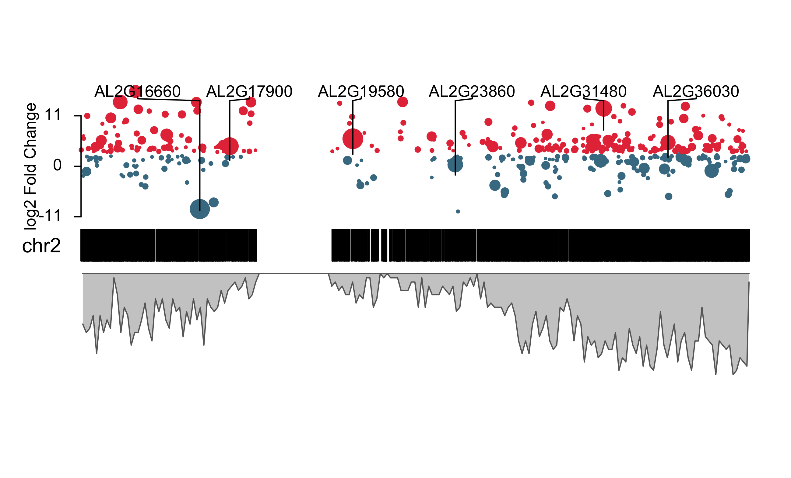
```

